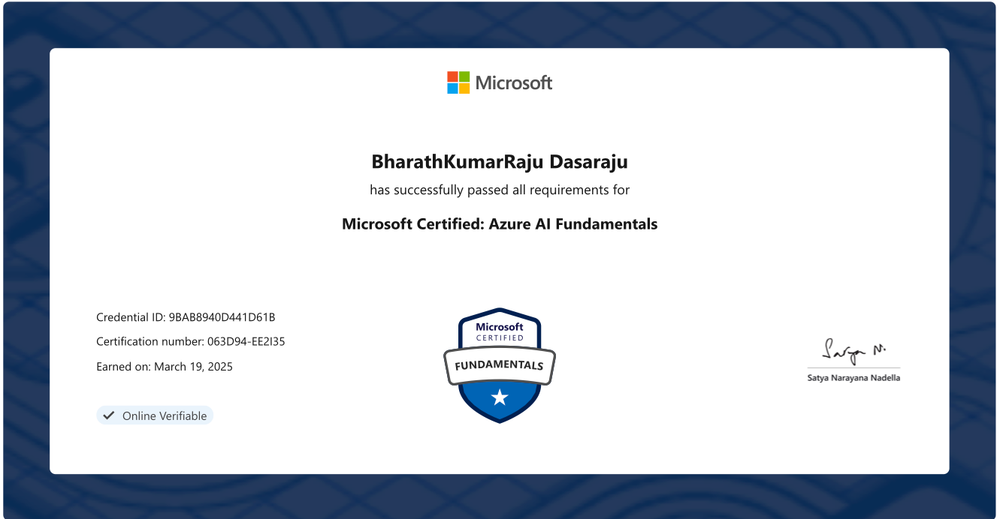

# learn-ai-ml-llm-ops
GenAI , LLM(Large Language Models) and Machine-Learning(ML) Models Development and Deployment

## Azure AI Certification - AI 900 AI fundamentals

## How to view vector Embeddings in 3D

- 🔗 [**Vector Embeddings Visualized**](https://medium.com/@bhrth.dsra1/tokenization-visualizing-vector-embeddings-in-multi-dimensional-space-3d-dc4667402b4e)

## 🚀 Why Vector Search is So Fast

- 🔗 [**Distance Metrics in Vector Search**](https://weaviate.io/blog/distance-metrics-in-vector-search)
- 🔗 [**Vector Search Explained**](https://weaviate.io/blog/vector-search-explained)