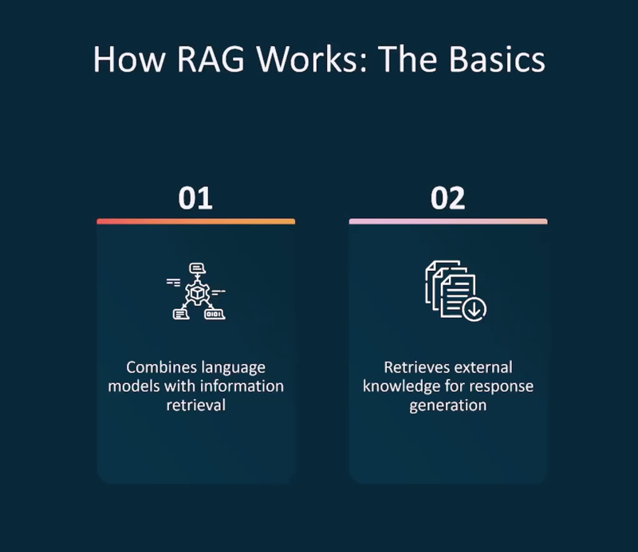

==========================================
GenAI Learning
==========================================

**GenAI Learning - Getting Started**

.. literalinclude:: ../../../10.GenAI-Learning/1.demo.sh
  :language: bash
  :caption: GenAI Initial Demo
  :linenos:

**Foundation Model Lifecycle**

.. literalinclude:: ../../../10.GenAI-Learning/2.Foundation-model-lifecycle.sh
  :language: bash
  :caption: Foundation Model Lifecycle Script
  :linenos:

**Foundational Models & Applications**

.. literalinclude:: ../../../10.GenAI-Learning/3.Foundational_models_apps.sh
  :language: bash
  :caption: Foundational Models Applications
  :linenos:

**Choose Model Based on Metrics**

**Retrieval Augmented Generation (RAG)**

**How RAG Works**

**RAG Shell Script**

.. literalinclude:: ../../../10.GenAI-Learning/4.Retrieval_Augmented_generation.sh
  :language: bash
  :caption: Retrieval Augmented Generation Script
  :linenos:

**Vector Databases**

.. literalinclude:: ../../../10.GenAI-Learning/5.vector_databases.sh
  :language: bash
  :caption: Vector Databases Overview
  :linenos:

**Foundation Model Customizations**

**Amazon Bedrock Agents**

**Foundational Models**

.. literalinclude:: ../../../10.GenAI-Learning/6.Foundational_models.sh
  :language: bash
  :caption: Foundational Models Script
  :linenos:

**Prompt Engineering**

.. literalinclude:: ../../../10.GenAI-Learning/8.prompt_engineering.sh
  :language: bash
  :caption: Prompt Engineering Practices
  :linenos:

**Model Performance Evaluation**

.. literalinclude:: ../../../10.GenAI-Learning/9.Foundational_model_performance.sh
  :language: bash
  :caption: Foundational Model Performance Script
  :linenos:

**Responsible AI Practices**

.. literalinclude:: ../../../10.GenAI-Learning/10.responsible-ai.sh
  :language: bash
  :caption: Responsible AI Considerations
  :linenos:

**Security, Compliance & Governance**

.. literalinclude:: ../../../10.GenAI-Learning/11.Security_compliance_governance.sh
  :language: bash
  :caption: Security and Governance in GenAI
  :linenos:
