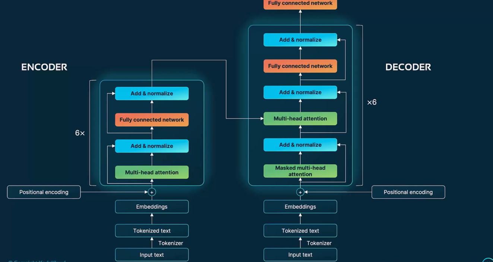
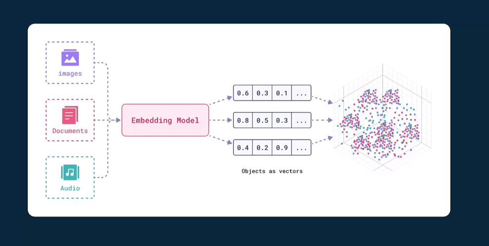

==========================================
OpenAI Overview
==========================================

**Intro to OpenAI (Shell Script)**

.. literalinclude:: ../../../11.OpenAI/1.intro-openai.sh
  :language: bash
  :caption: Introduction to OpenAI CLI and API
  :linenos:

**Penguins Story (Python Script)**

.. literalinclude:: ../../../11.OpenAI/penguins_story.py
  :language: python
  :caption: A storytelling script using OpenAI
  :linenos:

**Text-to-Speech Output (Audio)**

.. note::

   The following file is an audio MP3 generated from a text-to-speech task.

   - File: ``tts_example.mp3``
   - Path: ``../../../11.OpenAI/tts_example.mp3``

**Haiku Generator (Shell Script)**

.. literalinclude:: ../../../11.OpenAI/2.generate_haiku_japanese_poem.sh
  :language: bash
  :caption: Bash script to generate a Japanese-style Haiku using OpenAI
  :linenos:

**OpenAI Usage Overview (Image)**

**Chat Completions API (Shell Script)**

.. literalinclude:: ../../../11.OpenAI/3.chat_completions_api.sh
  :language: bash
  :caption: Script demonstrating OpenAI's Chat Completions API
  :linenos:

**OpenAI Model Pricing (Image)**

**Multi-Prompt Chat (Python Script)**

.. literalinclude:: ../../../11.OpenAI/openai_multi_prompts.py
  :language: python
  :caption: Python code demonstrating multi-prompt interactions
  :linenos:

**Image Generation (Python Script)**

.. literalinclude:: ../../../11.OpenAI/generate_ai_image.py
  :language: python
  :caption: Generate AI image using DALL·E
  :linenos:

**Generated Image (DALL·E 3)**

.. image:: ../../../11.OpenAI/dall-e-3-generated-image.png
    :width: 100%
    :align: center

**Personalized Image Generation (Python Script)**

.. literalinclude:: ../../../11.OpenAI/generate_ai_image_personal.py
  :language: python
  :caption: Generate personalized image via OpenAI API
  :linenos:

**Generated Image (Personalized)**

.. image:: ../../../11.OpenAI/generated_personal_ai_image.png
    :width: 100%
    :align: center

**Generate Poem About Recursion**

.. literalinclude:: ../../../11.OpenAI/1.OpenAI-Setup/generate_poem_about_recursion.py
  :language: python
  :caption: Python script generating a poem about recursion
  :linenos:

**How OpenAI Works (Shell Script)**

.. literalinclude:: ../../../11.OpenAI/1.OpenAI-Setup/1.How-OpenAI-works.sh
  :language: bash
  :caption: Introduction to how OpenAI works
  :linenos:

**Help Understanding Code**

.. literalinclude:: ../../../11.OpenAI/1.OpenAI-Setup/help_undrstanding_code.py
  :language: python
  :caption: Python script to help understand a given code snippet
  :linenos:

**Translate English to French**

.. literalinclude:: ../../../11.OpenAI/1.OpenAI-Setup/translate_english_to_frech.py
  :language: python
  :caption: Script to translate English to French using OpenAI
  :linenos:

**Medical History Generation**

.. literalinclude:: ../../../11.OpenAI/1.OpenAI-Setup/medical_history.py
  :language: python
  :caption: Generate medical history summaries
  :linenos:

**Patient Medical History (CSV)**

.. note::

   This is a sample patient history dataset used in OpenAI prompts.

   - File: ``patient_medical_history.csv``
   - Path: ``../../../11.OpenAI/1.OpenAI-Setup/patient_medical_history.csv``

**Sentiment Analysis**

.. literalinclude:: ../../../11.OpenAI/1.OpenAI-Setup/sentiment_analysis.py
  :language: python
  :caption: Python script performing sentiment analysis with OpenAI
  :linenos:

**Compare Two Investments**

.. literalinclude:: ../../../11.OpenAI/1.OpenAI-Setup/comapare_two_investments.py
  :language: python
  :caption: Compare investment opportunities using OpenAI
  :linenos:

**OpenAI for Industries**

.. literalinclude:: ../../../11.OpenAI/1.OpenAI-Setup/2.OpenAI-for-industries.sh
  :language: bash
  :caption: Shell script showing OpenAI usage across industries
  :linenos:

**OpenAI Models Overview**

.. literalinclude:: ../../../11.OpenAI/1.OpenAI-Setup/3.openAI-models.sh
  :language: bash
  :caption: Overview of available OpenAI models
  :linenos:

**OpenAI Python Library Example**

.. literalinclude:: ../../../11.OpenAI/1.OpenAI-Setup/opeai_lib_python.py
  :language: python
  :caption: Python script showing how to use OpenAI Python SDK
  :linenos:

**Azure OpenAI Libraries (Image)**

**OpenAI Libraries (Shell Script)**

.. literalinclude:: ../../../11.OpenAI/1.OpenAI-Setup/4.OpenAI-libraries.sh
  :language: bash
  :caption: Installation and usage of OpenAI-related libraries
  :linenos:

**ML Transition Overview**

**Machine Learning vs Deep Learning**

**AI vs Data**

**Evolution of AI**

.. literalinclude:: ../../../11.OpenAI/2.OpenAI-Usage/1.evolution_of_ai.sh
  :language: bash
  :caption: AI evolution timeline overview
  :linenos:

**Transformers in GenAI**

**Pretraining vs Fine-tuning**

**Transformer Architecture**

**Transformers GenAI Script**

.. literalinclude:: ../../../11.OpenAI/2.OpenAI-Usage/2.transfomers-genAI.sh
  :language: bash
  :caption: Shell script on transformer models in GenAI
  :linenos:

**Fine-tuning Visual**

**Pretraining & Fine-tuning Shell Script**

.. literalinclude:: ../../../11.OpenAI/2.OpenAI-Usage/3.Pretraining-finetuning-LLMs.sh
  :language: bash
  :caption: Shell script discussing LLM model training strategies
  :linenos:

**Prompt Example**

.. literalinclude:: ../../../11.OpenAI/2.OpenAI-Usage/prompt_example.py
  :language: python
  :caption: Prompt usage example for OpenAI
  :linenos:

**Basic Prompt Engineering Script**

.. literalinclude:: ../../../11.OpenAI/2.OpenAI-Usage/4.Basic-prompt-engineering.sh
  :language: bash
  :caption: Bash walkthrough of prompt engineering concepts
  :linenos:

**Tokenization in LLMs**

**Tokenization Script**

.. literalinclude:: ../../../11.OpenAI/2.OpenAI-Usage/5.Tokenization.sh
  :language: bash
  :caption: Script explaining LLM tokenization
  :linenos:

**Tokenization in AI Models**

**Zero-shot and Few-shot Prompting**

.. literalinclude:: ../../../11.OpenAI/2.OpenAI-Usage/6.Zeroshot-FewShot-prompting.sh
  :language: bash
  :caption: Examples of zero/few-shot prompting
  :linenos:

**Grounding LLMs - Visual**

**RAG Architecture Diagram**

**Grounding LLMs Shell Script**

.. literalinclude:: ../../../11.OpenAI/2.OpenAI-Usage/7.Grounding_LLMS.sh
  :language: bash
  :caption: Script showing RAG and grounding LLMs
  :linenos:

**Transformer Encoder-Decoder**

**Encoders for LLM Prompt Processing**

.. literalinclude:: ../../../11.OpenAI/2.OpenAI-Usage/9.Encoders_allow_LLMs_process_prompts.sh
  :language: bash
  :caption: Encoders enabling prompt processing in LLMs
  :linenos:

**LLM Prompt Processing Diagram**

**Bias and Fairness in LLMs**

.. literalinclude:: ../../../11.OpenAI/2.OpenAI-Usage/10.bias_fairness_llms.sh
  :language: bash
  :caption: Addressing bias and fairness in large language models
  :linenos:

**Multimodal Inputs in GenAI**

.. literalinclude:: ../../../11.OpenAI/2.OpenAI-Usage/11.multimodal-inputs-genAI.sh
  :language: bash
  :caption: Handling multimodal inputs in generative AI
  :linenos:

**AI Code Generation - v1**

.. literalinclude:: ../../../11.OpenAI/2.OpenAI-Usage/demo_prompts/ai_code_gen.py
  :language: python
  :caption: Generate Python code with OpenAI API
  :linenos:

**AI Code Generation - v3**

.. literalinclude:: ../../../11.OpenAI/2.OpenAI-Usage/demo_prompts/ai_code_gen3.py
  :language: python
  :caption: Refined AI code generation
  :linenos:

**AI Code Generation - v4**

.. literalinclude:: ../../../11.OpenAI/2.OpenAI-Usage/demo_prompts/ai_code_gen4.py
  :language: python
  :caption: Latest version of code generation example
  :linenos:

**OpenAI API Key Setup Script**

.. literalinclude:: ../../../11.OpenAI/2.OpenAI-Usage/demo_prompts/1.openAI_apikeys.sh
  :language: bash
  :caption: Script to manage OpenAI API keys
  :linenos:

**AI Code Generation - v2**

.. literalinclude:: ../../../11.OpenAI/2.OpenAI-Usage/demo_prompts/ai_code_gen2.py
  :language: python
  :caption: Another example of AI-based code generation
  :linenos:

==========================================
OpenAI Text Generation
==========================================

**Story Generator**

.. literalinclude:: ../../../11.OpenAI/3.TextGeneration/generate_stoty.py
  :language: python
  :caption: Simple story generation script
  :linenos:

**Demo Launcher**

.. literalinclude:: ../../../11.OpenAI/3.TextGeneration/1.demo.sh
  :language: bash
  :caption: Demo script for launching text generation examples
  :linenos:

**Tokenization Example**

.. literalinclude:: ../../../11.OpenAI/3.TextGeneration/example_tokenization.py
  :language: python
  :caption: Demonstrating tokenization techniques
  :linenos:

**Tokenization Shell Script**

.. literalinclude:: ../../../11.OpenAI/3.TextGeneration/2.tokenization_example.sh
  :language: bash
  :caption: Tokenization demo via shell script
  :linenos:

**Prompt Engineering - Python**

.. literalinclude:: ../../../11.OpenAI/3.TextGeneration/prompt_engineering.py
  :language: python
  :caption: Prompt engineering examples using Python
  :linenos:

**Generate Blog Post**

.. literalinclude:: ../../../11.OpenAI/3.TextGeneration/generate_blog_post.py
  :language: python
  :caption: Script for blog post generation
  :linenos:

**Prompt Engineering - Bash**

.. literalinclude:: ../../../11.OpenAI/3.TextGeneration/3.prompt_engineering.sh
  :language: bash
  :caption: Shell script for prompt engineering
  :linenos:

**Generate Summary**

.. literalinclude:: ../../../11.OpenAI/3.TextGeneration/generate_summary.py
  :language: python
  :caption: Automatic summary generation
  :linenos:

**Customer Support Assistant Generator**

.. literalinclude:: ../../../11.OpenAI/3.TextGeneration/generate_customer_support.py
  :language: python
  :caption: Customer support text generation
  :linenos:

**Generate Code Comments**

.. literalinclude:: ../../../11.OpenAI/3.TextGeneration/generate_code_comments.py
  :language: python
  :caption: Generate comments for source code
  :linenos:

**Practical Applications Script**

.. literalinclude:: ../../../11.OpenAI/3.TextGeneration/4.practiacl_apps.sh
  :language: bash
  :caption: Prompt-based practical app script
  :linenos:

**Sentiment Analysis (Old API)**

.. literalinclude:: ../../../11.OpenAI/3.TextGeneration/sentiment-analysis-old-api.py
  :language: python
  :caption: Sentiment detection with older OpenAI API
  :linenos:

**Sentiment Analysis (New)**

.. literalinclude:: ../../../11.OpenAI/3.TextGeneration/sentiment-analysis.py
  :language: python
  :caption: Updated sentiment analysis code
  :linenos:

.. literalinclude:: ../../../11.OpenAI/3.TextGeneration/5.Sentiment_analysis_with_openai.sh
  :language: bash
  :caption: Shell script for sentiment analysis
  :linenos:

**Training Data**

.. literalinclude:: ../../../11.OpenAI/3.TextGeneration/mydata.jsonl
  :language: json
  :caption: Sample JSONL file for fine-tuning

**Fine-tuning Sentiment Analysis**

.. literalinclude:: ../../../11.OpenAI/3.TextGeneration/sentiment_analysis_finetuning.py
  :language: python
  :caption: Fine-tuning sentiment analysis using OpenAI API
  :linenos:

**Aspect-based Sentiment Analysis**

.. literalinclude:: ../../../11.OpenAI/3.TextGeneration/aspect_analysis.py
  :language: python
  :caption: Analyzing different aspects of text sentiment
  :linenos:

.. literalinclude:: ../../../11.OpenAI/3.TextGeneration/6.aspect_analysis.sh
  :language: bash
  :caption: Shell script for aspect-based sentiment analysis
  :linenos:

**Customer Support Assistant**

.. literalinclude:: ../../../11.OpenAI/3.TextGeneration/customer_support_assistant.py
  :language: python
  :caption: Generate support responses with OpenAI
  :linenos:

.. literalinclude:: ../../../11.OpenAI/3.TextGeneration/7.openai_assistants.sh
  :language: bash
  :caption: Shell integration with OpenAI assistants
  :linenos:

**More Training Data**

.. literalinclude:: ../../../11.OpenAI/3.TextGeneration/data.jsonl
  :language: json
  :caption: Additional JSONL training dataset

**Fine-tuning Scripts**

.. literalinclude:: ../../../11.OpenAI/3.TextGeneration/fine-tuning.py
  :language: python
  :caption: Starting a fine-tuning job
  :linenos:

.. literalinclude:: ../../../11.OpenAI/3.TextGeneration/file-abc123.jsonl
  :language: json
  :caption: File used in fine-tuning job

.. literalinclude:: ../../../11.OpenAI/3.TextGeneration/run-fine-tuned-model.py
  :language: python
  :caption: Using a fine-tuned model
  :linenos:

.. literalinclude:: ../../../11.OpenAI/3.TextGeneration/8.FIne-Tuning.sh
  :language: bash
  :caption: Fine-tuning automation script
  :linenos:

**Using Fine-tuned Model**

.. literalinclude:: ../../../11.OpenAI/3.TextGeneration/use_fine_tune_model.py
  :language: python
  :caption: Script to query fine-tuned model
  :linenos:

**Embedding Models Diagram**

**Embedding Examples**

.. literalinclude:: ../../../11.OpenAI/3.TextGeneration/embedding_example.py
  :language: python
  :caption: Sample text embedding
  :linenos:

.. literalinclude:: ../../../11.OpenAI/3.TextGeneration/embeddings_example2.py
  :language: python
  :caption: Additional embedding example
  :linenos:

.. literalinclude:: ../../../11.OpenAI/3.TextGeneration/9.embeddings.sh
  :language: bash
  :caption: Embedding workflows with OpenAI
  :linenos:

**Text-to-Speech**

.. literalinclude:: ../../../11.OpenAI/3.TextGeneration/text_to_speech.py
  :language: python
  :caption: Generate speech from text
  :linenos:

.. image:: ../../../11.OpenAI/3.TextGeneration/tts_example.mp3
    :align: center

**Speech-to-Text**

.. literalinclude:: ../../../11.OpenAI/3.TextGeneration/speech_to_text.py
  :language: python
  :caption: Convert speech to text
  :linenos:

.. literalinclude:: ../../../11.OpenAI/3.TextGeneration/10.Text_to_Speech.sh
  :language: bash
  :caption: TTS/STT integration script
  :linenos:

------------------------------------------
Text Generation - Demo Scripts
------------------------------------------

.. literalinclude:: ../../../11.OpenAI/3.TextGeneration/demos/fitness.csv
  :language: none
  :caption: Sample dataset for demo use

.. literalinclude:: ../../../11.OpenAI/3.TextGeneration/demos/chat_completion1.py
  :language: python
  :caption: OpenAI Chat Completion v1
  :linenos:

.. literalinclude:: ../../../11.OpenAI/3.TextGeneration/demos/tell_a_joke.py
  :language: python
  :caption: Generate a joke using ChatGPT
  :linenos:

.. literalinclude:: ../../../11.OpenAI/3.TextGeneration/demos/1.chat_completions.sh
  :language: bash
  :caption: Chat completions shell script
  :linenos:

.. literalinclude:: ../../../11.OpenAI/3.TextGeneration/demos/tell_a_joke_new.py
  :language: python
  :caption: Updated joke generation script
  :linenos:

.. literalinclude:: ../../../11.OpenAI/3.TextGeneration/demos/2.chat_completion_v1.sh
  :language: bash
  :caption: OpenAI v1 completions shell script
  :linenos:

.. literalinclude:: ../../../11.OpenAI/3.TextGeneration/demos/recipe_generator.py
  :language: python
  :caption: Generate cooking recipes
  :linenos:

.. literalinclude:: ../../../11.OpenAI/3.TextGeneration/demos/3.Recipe_generator.sh
  :language: bash
  :caption: Script to generate food recipes
  :linenos:

.. literalinclude:: ../../../11.OpenAI/3.TextGeneration/demos/translate_article.py
  :language: python
  :caption: Translate content with OpenAI
  :linenos:

.. literalinclude:: ../../../11.OpenAI/3.TextGeneration/demos/4.translate_article.sh
  :language: bash
  :caption: Translation via OpenAI shell
  :linenos:

.. literalinclude:: ../../../11.OpenAI/3.TextGeneration/demos/5.Create_a_story.sh
  :language: bash
  :caption: Shell story generator with LLM
  :linenos:

.. literalinclude:: ../../../11.OpenAI/3.TextGeneration/demos/gen-short-story.py
  :language: python
  :caption: Short story generator
  :linenos:

.. literalinclude:: ../../../11.OpenAI/3.TextGeneration/demos/users.csv
  :language: none
  :caption: User dataset for personalized training

.. literalinclude:: ../../../11.OpenAI/3.TextGeneration/demos/ai_research_assistant.py
  :language: python
  :caption: OpenAI for AI research assistant
  :linenos:

.. literalinclude:: ../../../11.OpenAI/3.TextGeneration/demos/6.AI_research_assistant.sh
  :language: bash
  :caption: Research assistant shell script
  :linenos:

.. literalinclude:: ../../../11.OpenAI/3.TextGeneration/demos/personal_trainer.py
  :language: python
  :caption: Virtual personal trainer using LLM
  :linenos:

.. literalinclude:: ../../../11.OpenAI/3.TextGeneration/demos/7.personal_trainer.sh
  :language: bash
  :caption: Shell integration for personal trainer
  :linenos:

.. literalinclude:: ../../../11.OpenAI/3.TextGeneration/demos/tts.py
  :language: python
  :caption: Another TTS example
  :linenos:

.. literalinclude:: ../../../11.OpenAI/3.TextGeneration/demos/8.text_to_speech.sh
  :language: bash
  :caption: TTS shell script integration
  :linenos:

==========================================
OpenAI Features & Output Formatting
==========================================

**Structured Output (Basic)**

.. literalinclude:: ../../../11.OpenAI/4.Features/1.Structured_outputs.py
  :language: python
  :caption: Generating structured outputs with OpenAI
  :linenos:

**Structured Output to JSON**

.. literalinclude:: ../../../11.OpenAI/4.Features/2.structured_ouput_to_json.py
  :language: python
  :caption: Convert OpenAI output to JSON
  :linenos:

**Structured Output to Markdown**

.. literalinclude:: ../../../11.OpenAI/4.Features/3.structured_output_markdown.py
  :language: python
  :caption: Convert model output to markdown format
  :linenos:

**API Documentation (Markdown)**

.. literalinclude:: ../../../11.OpenAI/4.Features/api_documentation.md
  :language: markdown
  :caption: Example API documentation generated via OpenAI

**Structured Output to CSV**

.. literalinclude:: ../../../11.OpenAI/4.Features/4.structured_output_csv.py
  :language: python
  :caption: CSV structured output using OpenAI
  :linenos:

.. literalinclude:: ../../../11.OpenAI/4.Features/sales_report.csv
  :language: none
  :caption: Sample sales report output

**Structured Output to XML**

.. literalinclude:: ../../../11.OpenAI/4.Features/5.structured_output_xml.py
  :language: python
  :caption: XML formatting with OpenAI output
  :linenos:

.. literalinclude:: ../../../11.OpenAI/4.Features/db_config.xml
  :language: xml
  :caption: Sample XML configuration file

**Recipe Generation (JSON Output)**

.. literalinclude:: ../../../11.OpenAI/4.Features/6.recipe_gen_json.py
  :language: python
  :caption: Recipe generation with JSON output format
  :linenos:

**Advanced Recipe Generator**

.. literalinclude:: ../../../11.OpenAI/4.Features/7.recipe_gen2.py
  :language: python
  :caption: Improved recipe generator
  :linenos:

.. literalinclude:: ../../../11.OpenAI/4.Features/recipe_output.json
  :language: json
  :caption: Example JSON output of recipe

**Reinforcement Learning Explanation**

.. literalinclude:: ../../../11.OpenAI/4.Features/8.reinforcement_learning.py
  :language: python
  :caption: Explain reinforcement learning using OpenAI
  :linenos:

**External Data Analysis with OpenAI**

.. literalinclude:: ../../../11.OpenAI/4.Features/9.external_data_analysis.py
  :language: python
  :caption: Analyze external data using OpenAI models
  :linenos:

**Multi-term Conversation**

.. literalinclude:: ../../../11.OpenAI/4.Features/10.Multi-term-conversation.py
  :language: python
  :caption: Multi-turn conversational modeling
  :linenos:

**Article Generation**

.. literalinclude:: ../../../11.OpenAI/4.Features/11.Article_generation.py
  :language: python
  :caption: Long-form content generation with OpenAI
  :linenos:

.. literalinclude:: ../../../11.OpenAI/4.Features/ai_healthcare_article.txt
  :language: none
  :caption: AI-generated healthcare article

**Batch Processing**

.. literalinclude:: ../../../11.OpenAI/4.Features/12.batch_processing.py
  :language: python
  :caption: Automating OpenAI requests in batches
  :linenos:

**Fixed Batch Processing**

.. literalinclude:: ../../../11.OpenAI/4.Features/13.batch_processing_fixed.py
  :language: python
  :caption: Enhanced batch processing logic
  :linenos:

**Moderation Example 1**

.. literalinclude:: ../../../11.OpenAI/4.Features/14.Moderations.py
  :language: python
  :caption: Content moderation using OpenAI
  :linenos:

**Moderation Example 2**

.. literalinclude:: ../../../11.OpenAI/4.Features/15.Moderations.py
  :language: python
  :caption: Another moderation use-case
  :linenos:

------------------------------------------
Feature Demos (Shell Scripts)
------------------------------------------

.. literalinclude:: ../../../11.OpenAI/4.Features/docs/1.demo.sh
  :language: bash
  :caption: Demo entry script
  :linenos:

**Structured Outputs Demo**

.. literalinclude:: ../../../11.OpenAI/4.Features/docs/1.Structured_outputs.sh
  :language: bash
  :caption: Structured output shell integration
  :linenos:

**Reinforcement Learning (Shell)**

.. literalinclude:: ../../../11.OpenAI/4.Features/docs/2.reinforcement_learning.sh
  :language: bash
  :caption: Shell demo for reinforcement learning
  :linenos:

**Stock Analysis Script**

.. literalinclude:: ../../../11.OpenAI/4.Features/docs/3.stock_analysis.sh
  :language: bash
  :caption: Financial stock analysis using OpenAI
  :linenos:

**Multi-turn Conversation Script**

.. literalinclude:: ../../../11.OpenAI/4.Features/docs/4.Multi-term-conversation.sh
  :language: bash
  :caption: Shell script for multi-turn chat
  :linenos:

**Long-form Content Planner**

.. literalinclude:: ../../../11.OpenAI/4.Features/docs/5.Long-form-content-generation-with-planning.sh
  :language: bash
  :caption: Plan and generate long-form content
  :linenos:

**Batch Processing Executor**

.. literalinclude:: ../../../11.OpenAI/4.Features/docs/6.Batch_processing.sh
  :language: bash
  :caption: Run batch OpenAI queries
  :linenos:

**Moderation Script**

.. literalinclude:: ../../../11.OpenAI/4.Features/docs/7.Moderation.sh
  :language: bash
  :caption: Shell-based content moderation
  :linenos:

==========================================
OpenAI Vision Capabilities
==========================================

**Basic Vision API Usage**

.. literalinclude:: ../../../11.OpenAI/5.Vision/1.openai-vision.py
  :language: python
  :caption: Using OpenAI Vision API
  :linenos:

.. literalinclude:: ../../../11.OpenAI/5.Vision/1.demo.sh
  :language: bash
  :caption: Demo script for Vision API
  :linenos:

**Object Detection in Images**

.. literalinclude:: ../../../11.OpenAI/5.Vision/2.open-api-vision-objects.py
  :language: python
  :caption: Detecting objects with Vision API
  :linenos:

**Image Question & Answer**

.. literalinclude:: ../../../11.OpenAI/5.Vision/3.image_Q_and_A.py
  :language: python
  :caption: Asking questions about images
  :linenos:

**Image Generation using DALL·E**

.. literalinclude:: ../../../11.OpenAI/5.Vision/4.openai-vision-dalle.py
  :language: python
  :caption: Generate images with DALL·E
  :linenos:

**Advanced DALL·E Prompts**

.. literalinclude:: ../../../11.OpenAI/5.Vision/5.openai-visio-dalle2.py
  :language: python
  :caption: Another DALL·E example
  :linenos:

.. literalinclude:: ../../../11.OpenAI/5.Vision/6.openai-dalle.py
  :language: python
  :caption: DALL·E Prompt Example 1
  :linenos:

.. literalinclude:: ../../../11.OpenAI/5.Vision/7.openai-dalle.py
  :language: python
  :caption: DALL·E Prompt Example 2
  :linenos:

**AI Image Samples**

.. literalinclude:: ../../../11.OpenAI/5.Vision/8.delle-generate-image.py
  :language: python
  :caption: DALL·E Prompt Example 3
  :linenos:

**Practical DALL·E Applications**

.. literalinclude:: ../../../11.OpenAI/5.Vision/9.practical-apps-dalle.py
  :language: python
  :linenos:

.. literalinclude:: ../../../11.OpenAI/5.Vision/10.practical-apps-dalle.py
  :language: python
  :linenos:

.. literalinclude:: ../../../11.OpenAI/5.Vision/11.practical-apps-dalle.py
  :language: python
  :linenos:

.. literalinclude:: ../../../11.OpenAI/5.Vision/12.practical-apps-dalle.py
  :language: python
  :linenos:

.. literalinclude:: ../../../11.OpenAI/5.Vision/13.practical-apps-dalle.py
  :language: python
  :linenos:

.. literalinclude:: ../../../11.OpenAI/5.Vision/14.practical-apps-dalle.py
  :language: python
  :linenos:

.. literalinclude:: ../../../11.OpenAI/5.Vision/15.practical-apps-dalle.py
  :language: python
  :linenos:

.. image:: ../../../11.OpenAI/5.Vision/modern_house.png
  :width: 100%
  :align: center

.. literalinclude:: ../../../11.OpenAI/5.Vision/16.practical-apps-dalle.py
  :language: python
  :linenos:

**CLIP for Vision Understanding**

.. literalinclude:: ../../../11.OpenAI/5.Vision/17.Contrastive-Language-Image-Pretraining-CLIP.py
  :language: python
  :caption: CLIP-based visual semantic understanding
  :linenos:

**Image Captioning with GPT/Vision**

.. literalinclude:: ../../../11.OpenAI/5.Vision/18.image_captions.py
  :language: python
  :caption: Generate captions from image content
  :linenos:

**Penguin Identification (Fun Demo)**

.. literalinclude:: ../../../11.OpenAI/5.Vision/19.penguin.py
  :language: python
  :caption: Penguin classifier via OpenAI
  :linenos:

**Prompting the Image**

.. literalinclude:: ../../../11.OpenAI/5.Vision/20.prompting_the_image.py
  :language: python
  :caption: Interacting with images using prompts
  :linenos:

**Object Detection Example**

.. literalinclude:: ../../../11.OpenAI/5.Vision/21.detect_objects_in_image.py
  :language: python
  :caption: Detect objects in uploaded images
  :linenos:

**Vehicle Detection Sample**

.. literalinclude:: ../../../11.OpenAI/5.Vision/22.cars.py
  :language: python
  :caption: Classify and tag cars from image input
  :linenos:

------------------------------------------
Vision Demos (Shell Scripts)
------------------------------------------

**Vision API Shell Demo**

.. literalinclude:: ../../../11.OpenAI/5.Vision/docs/1.OpenAI-vision.sh
  :language: bash
  :caption: Basic Vision API workflow in shell
  :linenos:

**Image Generation (DALL·E) Script**

.. literalinclude:: ../../../11.OpenAI/5.Vision/docs/2.DALL-E.sh
  :language: bash
  :caption: Generate image from prompts using shell
  :linenos:

**Practical Applications of DALL·E**

.. literalinclude:: ../../../11.OpenAI/5.Vision/docs/3.Practical-application-of-Dalle.sh
  :language: bash
  :caption: Practical DALL·E integration examples
  :linenos:

**CLIP-Based Vision Script**

.. literalinclude:: ../../../11.OpenAI/5.Vision/docs/4.Contrastive-Language-Image-Pretraining-CLIP.sh
  :language: bash
  :caption: Vision semantic search using CLIP
  :linenos:

