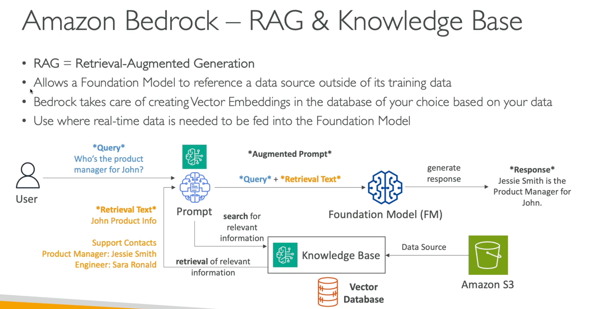

AWS AI Certification - Demo
==========================================

**Overview**

**AWS AI Demos**

.. literalinclude:: ../../../13.AWS-AI-Cert/1.demo.sh
  :language: bash
  :caption: Initial Demo Script for AWS AI Certification
  :linenos:

.. literalinclude:: ../../../13.AWS-AI-Cert/2.amazon_bedrock.sh
  :language: bash
  :caption: Amazon Bedrock Integration Script
  :linenos:

.. literalinclude:: ../../../13.AWS-AI-Cert/3.amazon_Q.sh
  :language: bash
  :caption: Amazon Q (LLM Assistant) Script
  :linenos:

.. literalinclude:: ../../../13.AWS-AI-Cert/4.ai-ml-dl.sh
  :language: bash
  :caption: AI, ML, DL Concepts Script
  :linenos:

.. literalinclude:: ../../../13.AWS-AI-Cert/5.ml.sh
  :language: bash
  :caption: Machine Learning AWS Example Script
  :linenos:

.. literalinclude:: ../../../13.AWS-AI-Cert/6.aws_ai_services.sh
  :language: bash
  :caption: AWS AI Services Commands
  :linenos:

**AI Concepts Visualized**

**📘 Additional AWS AI Demos**

- `prompting/ <https://github.com/Bharathkumarraju/learn-ai-llm-ml-ops/tree/main/13.AWS-AI-Cert/demos/aws_ai/prompting/>`_ – Prompt engineering text examples
- `bedrock/ <https://github.com/Bharathkumarraju/learn-ai-llm-ml-ops/tree/main/13.AWS-AI-Cert/demos/aws_ai/bedrock/>`_ – PDF Demo with Bedrock
- `ec2-fundamentals/ <https://github.com/Bharathkumarraju/learn-ai-llm-ml-ops/tree/main/13.AWS-AI-Cert/demos/aws_ai/ec2-fundamentals/>`_ – EC2 user-data shell examples
