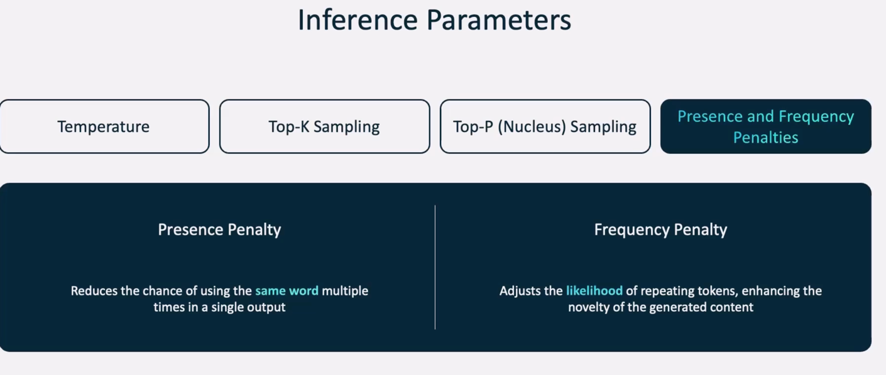
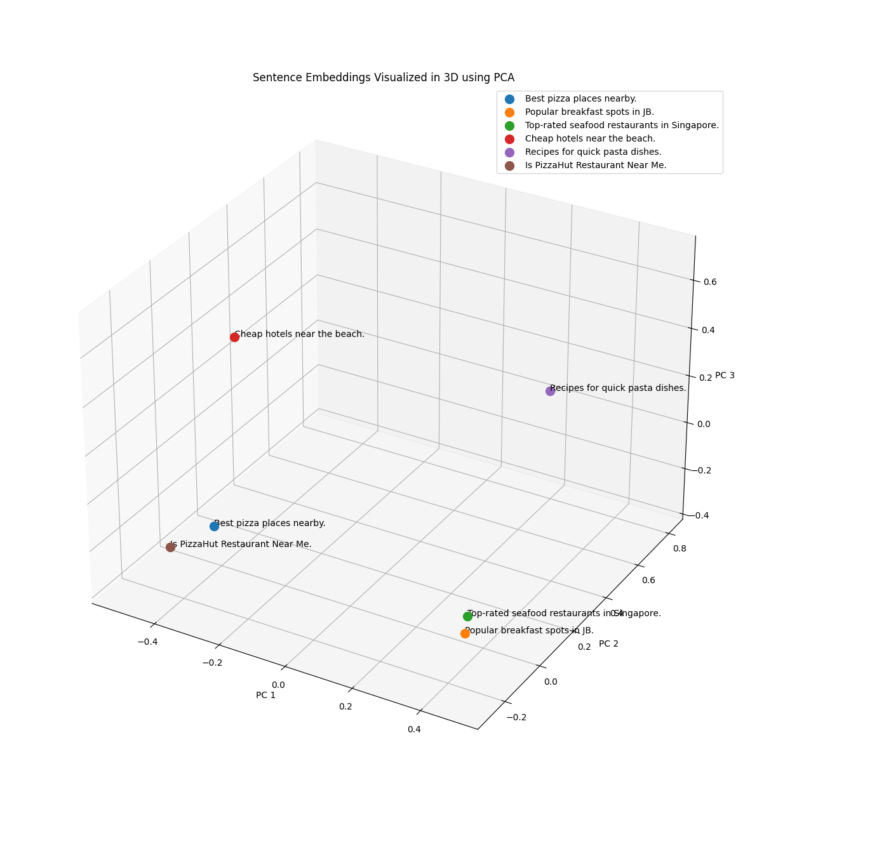

==========================================
Azure GenAI + LLM + RAG
==========================================

**Azure Examples**

.. literalinclude:: ../../../14.Azure_GenAI_LLM_RAG/1.Azure_examples.sh
  :language: bash
  :caption: Azure Examples
  :linenos:

**GenAI**

.. literalinclude:: ../../../14.Azure_GenAI_LLM_RAG/2.GenAI.sh
  :language: bash
  :caption: GenAI Concepts
  :linenos:

**Retrieval Augmented Generation**

.. literalinclude:: ../../../14.Azure_GenAI_LLM_RAG/3.Retrieval_Augmented_Generation.sh
  :language: bash
  :caption: Retrieval Augmented Generation
  :linenos:

**RAG Vector Search**

.. literalinclude:: ../../../14.Azure_GenAI_LLM_RAG/4.RAG_vector_search.sh
  :language: bash
  :caption: RAG Vector Search
  :linenos:

**Agentic RAG Systems**

.. literalinclude:: ../../../14.Azure_GenAI_LLM_RAG/5.Agentic_RAG_systems.sh
  :language: bash
  :caption: Agentic RAG Systems
  :linenos:

**Graph RAG**

.. literalinclude:: ../../../14.Azure_GenAI_LLM_RAG/6.Graph_RAG.sh
  :language: bash
  :caption: Graph RAG
  :linenos:

**Prompting Techniques**

.. literalinclude:: ../../../14.Azure_GenAI_LLM_RAG/6.prompting_techniques.sh
  :language: bash
  :caption: Prompting Techniques
  :linenos:

**LLMs Performance**

.. literalinclude:: ../../../14.Azure_GenAI_LLM_RAG/7.LLMs_performance.sh
  :language: bash
  :caption: LLMs Performance
  :linenos:

**Transformer Architecture**

**Standalone LLM vs RAG**

**RAG Vector Search Diagram**

**Vector Search Example**

**Generative LLM Diagram**

**Advanced RAG**

**3D Embedding Visualization**

**Dynamic Embeddings in RAG**

**Math in Transformers**

**Inference Parameter Visualizations**

**AI Studio in Action**

**Deploying Fine-tuned Models**

**LLM Leaderboard**

**Demo: Contoso Chat Setup**

.. literalinclude:: ../../../14.Azure_GenAI_LLM_RAG/demos/1.azure_ai_contoso_chat.sh
  :language: bash
  :caption: Setup Azure AI Contoso Chat
  :linenos:

**Contoso Chat Workshop PDF**

.. literalinclude:: ../../../14.Azure_GenAI_LLM_RAG/demos/Contoso_Chat_Workshop_Azure.pdf
  :language: none
  :caption: Contoso Chat Workshop Slides

**Vector Search and RAG - Shell Demos**

.. literalinclude:: ../../../14.Azure_GenAI_LLM_RAG/demos/RAG/1.vector_search.sh
  :language: bash
  :caption: Vector Search
  :linenos:

.. literalinclude:: ../../../14.Azure_GenAI_LLM_RAG/demos/RAG/2.vector_search_full_embeddings.sh
  :language: bash
  :caption: Full Embedding Vector Search
  :linenos:

.. literalinclude:: ../../../14.Azure_GenAI_LLM_RAG/demos/RAG/3.visualize_vector_search.sh
  :language: bash
  :caption: Visualize Vector Search
  :linenos:

.. literalinclude:: ../../../14.Azure_GenAI_LLM_RAG/demos/RAG/4.tokens_vector_embeddings.sh
  :language: bash
  :caption: Tokens to Embeddings
  :linenos:

**Vector Embeddings in 3D**

**Python Demos for Vector Search**

.. literalinclude:: ../../../14.Azure_GenAI_LLM_RAG/demos/RAG/1.vector_search.py
  :language: python
  :caption: Vector Search Python Script
  :linenos:

.. literalinclude:: ../../../14.Azure_GenAI_LLM_RAG/demos/RAG/2.vector_search_full_embeddings.py
  :language: python
  :caption: Full Embedding Search Python
  :linenos:

.. literalinclude:: ../../../14.Azure_GenAI_LLM_RAG/demos/RAG/3.visualize_vector_search.py
  :language: python
  :caption: Visualize Vector Search in Python
  :linenos:

.. literalinclude:: ../../../14.Azure_GenAI_LLM_RAG/demos/RAG/4.tokens_vector_embeddings.py
  :language: python
  :caption: Token Embedding Generation
  :linenos:

**RAG Application Setup**

.. literalinclude:: ../../../14.Azure_GenAI_LLM_RAG/demos/RAG-Application/1.install-contoso-chat.sh
  :language: bash
  :caption: Install Contoso Chat
  :linenos:

====================================================
Azure Samples – Contoso Chat (LLM RAG Application)
====================================================

This project demonstrates a complete Azure-based LLM RAG solution called **Contoso Chat**, integrating AI, vector search, and enterprise data with Azure infrastructure.

**Repository Highlights**

- 🧠 AI chat flow evaluation (`evaluate-chat-flow.ipynb`)
- 📊 CosmosDB, Azure Search & Azure Storage provisioning (via Bicep)
- 💬 Prompt templates and grounding data (`src/api/contoso_chat/`)
- 📦 Modular Azure infra (`infra/`) for AI, database, host, monitoring, etc.
- 📁 Sample data and customer/product metadata (`data/`)

**🛠 Setup Script**

.. literalinclude:: ../../../14.Azure_GenAI_LLM_RAG/azure-samples-contoso-chat/7.install-Azure-contoso-chat.sh
  :language: bash
  :caption: Install Azure Contoso Chat
  :linenos:

**📘 Key Resources**

- `README.md <https://github.com/Azure-Samples/azure-search-openai-demo>`_ – Overview and architecture
- `evaluate-chat-flow.ipynb` – End-to-end evaluation notebook
- `infra/` – Azure deployment templates (Bicep)
- `src/api/` – API backend including prompt logic, evaluations, tracing
- `data/` – CosmosDB, Azure Search and grounding examples

**📎 Additional Docs and Policies**

- CODE_OF_CONDUCT.md
- CONTRIBUTING.md
- LICENSE
- SECURITY.md
- SUPPORT.md

**📂 Folder Contents**

.. code-block:: bash

  ├── data/
  │   ├── customer_info/*.json
  │   ├── product_info/products.csv
  │   └── manual_info/contoso-manuals-index.ipynb
  ├── infra/
  │   ├── app/
  │   ├── core/
  │   └── hooks/
  ├── src/
  │   └── api/
  │       ├── contoso_chat/
  │       └── evaluators/
  ├── docker-compose.yml
  ├── azure.yaml
  └── img.png

**📘 Key Resources**

- `src/api/ <https://github.com/Bharathkumarraju/learn-ai-llm-ml-ops/tree/main/14.Azure_GenAI_LLM_RAG/azure-samples-contoso-chat/src/api/>`_ – Main backend logic, FastAPI services, tracing, and evaluation flows.
- `contoso_chat/ <https://github.com/Bharathkumarraju/learn-ai-llm-ml-ops/tree/main/14.Azure_GenAI_LLM_RAG/azure-samples-contoso-chat/src/api/contoso_chat/>`_ – Core chat handler and product logic.
- `custom_evals/ <https://github.com/Bharathkumarraju/learn-ai-llm-ml-ops/tree/main/14.Azure_GenAI_LLM_RAG/azure-samples-contoso-chat/src/api/evaluators/custom_evals/>`_ – Evaluation modules like fluency, coherence, etc.
- `prompt_templates/ <https://github.com/Bharathkumarraju/learn-ai-llm-ml-ops/tree/main/14.Azure_GenAI_LLM_RAG/azure-samples-contoso-chat/docs/workshop/src/1-build/>`_ – Prompt templates used in evaluation and experimentation.

**📘 prompty **

`.prompty` files define reusable **prompt templates** to evaluate large language models (LLMs) consistently. These prompts encapsulate evaluation metrics such as fluency, coherence, and grounding.

The following `.prompty` files are included:

**Evaluation Prompts:**

- `coherence.prompty <https://github.com/Bharathkumarraju/learn-ai-llm-ml-ops/blob/main/14.Azure_GenAI_LLM_RAG/azure-samples-contoso-chat/src/api/evaluators/custom_evals/coherence.prompty>`_ – Coherence Prompty
- `fluency.prompty <https://github.com/Bharathkumarraju/learn-ai-llm-ml-ops/blob/main/14.Azure_GenAI_LLM_RAG/azure-samples-contoso-chat/src/api/evaluators/custom_evals/fluency.prompty>`_ – Fluency Prompty
- `groundedness.prompty <https://github.com/Bharathkumarraju/learn-ai-llm-ml-ops/blob/main/14.Azure_GenAI_LLM_RAG/azure-samples-contoso-chat/src/api/evaluators/custom_evals/groundedness.prompty>`_ – Groundedness Prompty
- `relevance.prompty <https://github.com/Bharathkumarraju/learn-ai-llm-ml-ops/blob/main/14.Azure_GenAI_LLM_RAG/azure-samples-contoso-chat/src/api/evaluators/custom_evals/relevance.prompty>`_ – Relevance Prompty

**Chat & Response Templates:**

- `chat.prompty <https://github.com/Bharathkumarraju/learn-ai-llm-ml-ops/blob/main/14.Azure_GenAI_LLM_RAG/azure-samples-contoso-chat/src/api/contoso_chat/chat.prompty>`_ – Chat prompt template
- `product.prompty <https://github.com/Bharathkumarraju/learn-ai-llm-ml-ops/blob/main/14.Azure_GenAI_LLM_RAG/azure-samples-contoso-chat/src/api/contoso_chat/product/product.prompty>`_ – Product prompt template

**Workshop Demo Prompts:**

- `chat-0.prompty <https://github.com/Bharathkumarraju/learn-ai-llm-ml-ops/blob/main/14.Azure_GenAI_LLM_RAG/azure-samples-contoso-chat/docs/workshop/src/1-build/chat-0.prompty>`_ chat-0
- `chat-1.prompty <https://github.com/Bharathkumarraju/learn-ai-llm-ml-ops/blob/main/14.Azure_GenAI_LLM_RAG/azure-samples-contoso-chat/docs/workshop/src/1-build/chat-1.prompty>`_ chat-1
- `chat-2.prompty <https://github.com/Bharathkumarraju/learn-ai-llm-ml-ops/blob/main/14.Azure_GenAI_LLM_RAG/azure-samples-contoso-chat/docs/workshop/src/1-build/chat-2.prompty>`_ chat-2
- `chat-2-jailbreak.prompty <https://github.com/Bharathkumarraju/learn-ai-llm-ml-ops/blob/main/14.Azure_GenAI_LLM_RAG/azure-samples-contoso-chat/docs/workshop/src/1-build/chat-2-jailbreak.prompty>`_ chat-2
- `chat-3.prompty <https://github.com/Bharathkumarraju/learn-ai-llm-ml-ops/blob/main/14.Azure_GenAI_LLM_RAG/azure-samples-contoso-chat/docs/workshop/src/1-build/chat-3.prompty>`_ chat-3
- `chat-4.prompty <https://github.com/Bharathkumarraju/learn-ai-llm-ml-ops/blob/main/14.Azure_GenAI_LLM_RAG/azure-samples-contoso-chat/docs/workshop/src/1-build/chat-4.prompty>`_ chat-4
- `chat-exact.prompty <https://github.com/Bharathkumarraju/learn-ai-llm-ml-ops/blob/main/14.Azure_GenAI_LLM_RAG/azure-samples-contoso-chat/docs/workshop/src/1-build/chat-exact.prompty>`_ chat-exact
- `basic.prompty <https://github.com/Bharathkumarraju/learn-ai-llm-ml-ops/blob/main/14.Azure_GenAI_LLM_RAG/azure-samples-contoso-chat/docs/workshop/src/1-build/basic.prompty>`_ basic
- `friendliness.prompty <https://github.com/Bharathkumarraju/learn-ai-llm-ml-ops/blob/main/14.Azure_GenAI_LLM_RAG/azure-samples-contoso-chat/docs/workshop/src/1-build/friendliness.prompty>`_ friendliness

What is `.prompty`?
====================

**`.prompty`** is a custom file format used to define **structured LLM prompts**. Each file encapsulates:

- **Prompt instructions**
- **Placeholders or variables**
- **Scoring/evaluation metadata**

