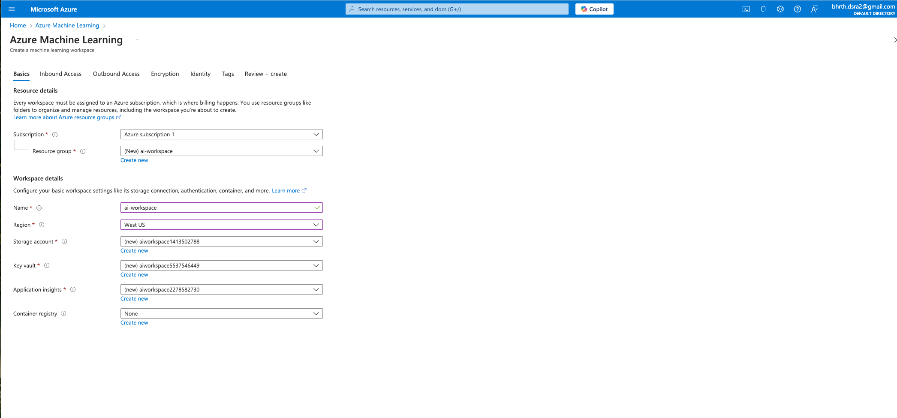
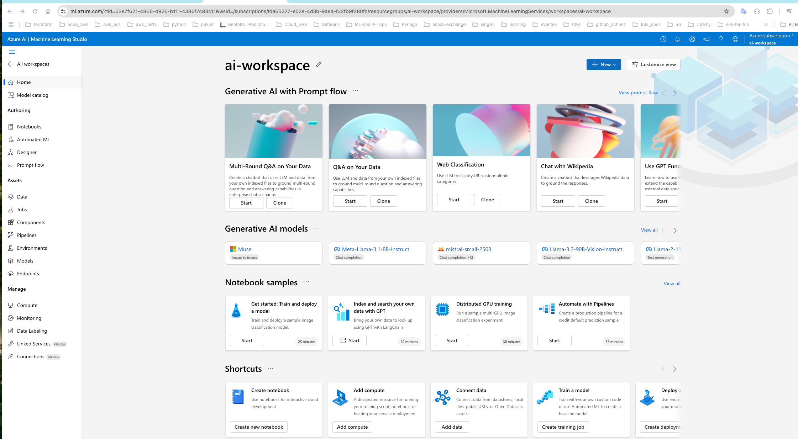
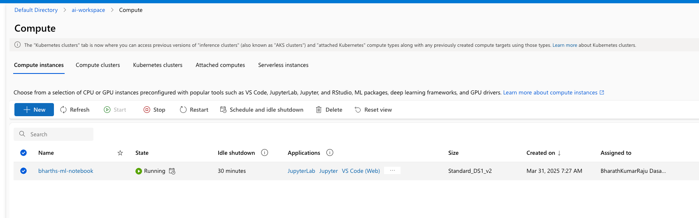
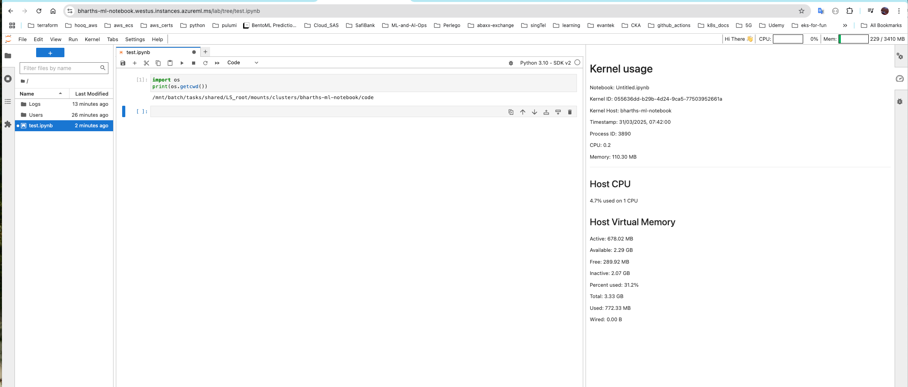
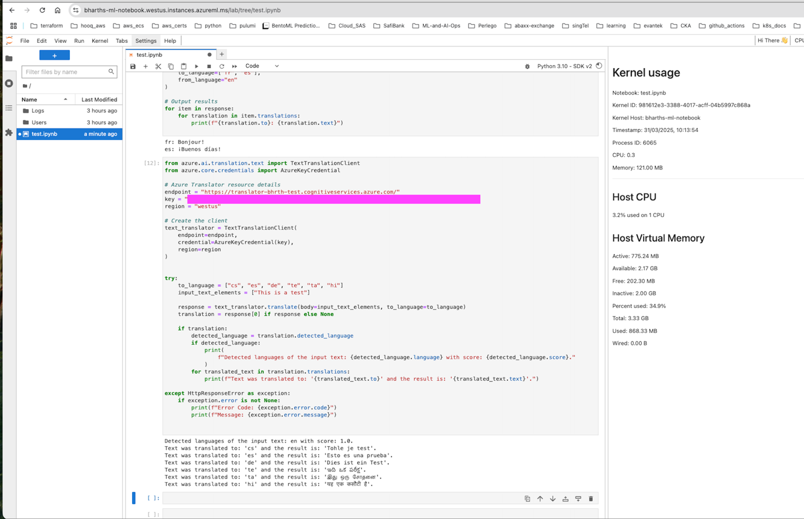

==========================================
Azure AI 102 Certification - Demo
==========================================

**Initial Setup Script**

.. literalinclude:: ../../../17.Azure_Ai102/1.demo_ai.sh
  :language: bash
  :caption: Initial Script for Azure AI 102
  :linenos:

**Azure AI Workspace Setup**

**Demo Use Cases**

.. literalinclude:: ../../../17.Azure_Ai102/demos/1.demo-azure-text-translation.sh
  :language: bash
  :caption: Azure Text Translation Shell Script
  :linenos:

.. literalinclude:: ../../../17.Azure_Ai102/demos/2.demo-azure-text-translation.sh
  :language: bash
  :caption: Azure Text Translation Shell Script 2
  :linenos:

.. literalinclude:: ../../../17.Azure_Ai102/demos/1.azure-text-translation.py
  :language: python
  :caption: Azure Text Translation Python Script 1
  :linenos:

.. literalinclude:: ../../../17.Azure_Ai102/demos/2.azure-text-translation.py
  :language: python
  :caption: Azure Text Translation Python Script 2
  :linenos:

**Demo Jupyter Notebooks**

.. toctree::
  :maxdepth: 1

  ../../../17.Azure_Ai102/demos/notebooks/test
  ../../../17.Azure_Ai102/demos/notebooks/test1

**Azure AI Domains - Shell Scripts & Python Modules**

.. literalinclude:: ../../../17.Azure_Ai102/1.Azure_AI_Solutions/1.demo.sh
  :language: bash
  :caption: Azure AI Solutions Demo
  :linenos:

.. literalinclude:: ../../../17.Azure_Ai102/1.Azure_AI_Solutions/2.Azure_AI_Services.sh
  :language: bash
  :linenos:

.. literalinclude:: ../../../17.Azure_Ai102/1.Azure_AI_Solutions/Azure_openAI/1.demo.sh
  :language: bash
  :linenos:

.. literalinclude:: ../../../17.Azure_Ai102/1.Azure_AI_Solutions/Azure_openAI/1.azure_openai_models.py
  :language: python
  :linenos:

.. literalinclude:: ../../../17.Azure_Ai102/1.Azure_AI_Solutions/Azure_AI/1.demo.sh
  :language: bash
  :linenos:

.. literalinclude:: ../../../17.Azure_Ai102/1.Azure_AI_Solutions/Azure_AI/1.azure_ai_services_endpoints.py
  :language: python
  :linenos:

.. literalinclude:: ../../../17.Azure_Ai102/1.Azure_AI_Solutions/Azure_AI/2.Azure_AI_Services.sh
  :language: bash
  :linenos:

.. literalinclude:: ../../../17.Azure_Ai102/1.Azure_AI_Solutions/Azure_AI/2.azure_ai_cohere_model.sh
  :language: bash
  :linenos:

.. literalinclude:: ../../../17.Azure_Ai102/1.Azure_AI_Solutions/Azure_AI/2.azure_ai_cohere_model.py
  :language: python
  :linenos:

.. literalinclude:: ../../../17.Azure_Ai102/1.Azure_AI_Solutions/Azure_AI/3.Azure_AI_Containers.sh
  :language: bash
  :linenos:

**Jupyter Notebooks**

.. toctree::
  :maxdepth: 1

  ../../../17.Azure_Ai102/jupyter_notebooks/computer-vision
  ../../../17.Azure_Ai102/jupyter_notebooks/face-service
  ../../../17.Azure_Ai102/jupyter_notebooks/form-recognizer
  ../../../17.Azure_Ai102/jupyter_notebooks/ocr
  ../../../17.Azure_Ai102/jupyter_notebooks/text-analysis

**Mini Demo Shell Scripts (Sub-Domains)**

.. literalinclude:: ../../../17.Azure_Ai102/2.Azure_AI_Moderation_Solutions/1.demo.sh
  :language: bash
  :linenos:

.. literalinclude:: ../../../17.Azure_Ai102/3.Azure_AI_Moderation_Solutions/1.demo.sh
  :language: bash
  :linenos:

.. literalinclude:: ../../../17.Azure_Ai102/4.Azure_AI_NLP_Solutions/1.demo.sh
  :language: bash
  :linenos:

.. literalinclude:: ../../../17.Azure_Ai102/5.Azure_AI_DocumentIntelligence_solutions/1.demo.sh
  :language: bash
  :linenos:

.. literalinclude:: ../../../17.Azure_Ai102/6.Azure_AI_GenAI_Solutions/1.demo.sh
  :language: bash
  :linenos:

.. literalinclude:: ../../../17.Azure_Ai102/intelligent-apps-with-AzureAI/1.demo.sh
  :language: bash
  :linenos:

**Azure-AI-Examples (from Microsoft GitHub)**

.. toctree::
  :maxdepth: 2

  ../../../17.Azure_Ai102/Azure-AI-Examples/form-recognizer/form-recognizer
  ../../../17.Azure_Ai102/Azure-AI-Examples/speech/speech-to-text
  ../../../17.Azure_Ai102/Azure-AI-Examples/speech/speech-translation
  ../../../17.Azure_Ai102/Azure-AI-Examples/speech/text-to-speech
  ../../../17.Azure_Ai102/Azure-AI-Examples/dall-e/dall-e
  ../../../17.Azure_Ai102/Azure-AI-Examples/translator/translator-simple
  ../../../17.Azure_Ai102/Azure-AI-Examples/translator/translator-failed
  ../../../17.Azure_Ai102/Azure-AI-Examples/text-analytics/textanalytics
  ../../../17.Azure_Ai102/Azure-AI-Examples/text-analytics/extraction
  ../../../17.Azure_Ai102/Azure-AI-Examples/content-saftey/analyze-text
  ../../../17.Azure_Ai102/Azure-AI-Examples/content-saftey/analyze-image
  ../../../17.Azure_Ai102/Azure-AI-Examples/azure-ai-search/basic-vector-workflow
  ../../../17.Azure_Ai102/Azure-AI-Examples/llms/basic/my-jp-teacher

**Prompt Flow (LLMOps Usecase)**

.. literalinclude:: ../../../17.Azure_Ai102/Azure-AI-Examples/prompt-flow/math-helper/format_output.py
  :language: python
  :caption: Format Output Script
  :linenos:

.. literalinclude:: ../../../17.Azure_Ai102/Azure-AI-Examples/prompt-flow/math-helper/llm_extract_answer.jinja2
  :language: jinja
  :linenos:

.. literalinclude:: ../../../17.Azure_Ai102/Azure-AI-Examples/prompt-flow/math-helper/chat.jinja2
  :language: jinja
  :linenos:

.. literalinclude:: ../../../17.Azure_Ai102/Azure-AI-Examples/prompt-flow/math-helper/openai.yaml
  :language: yaml
  :linenos:

.. literalinclude:: ../../../17.Azure_Ai102/Azure-AI-Examples/prompt-flow/math-helper/azure_openai.yaml
  :language: yaml
  :linenos:

.. literalinclude:: ../../../17.Azure_Ai102/Azure-AI-Examples/prompt-flow/math-helper/flow.dag.yaml
  :language: yaml
  :linenos:

.. literalinclude:: ../../../17.Azure_Ai102/Azure-AI-Examples/prompt-flow/math-helper/requirements.txt
  :language: text
  :linenos:

**End of Azure AI 102 Content**
