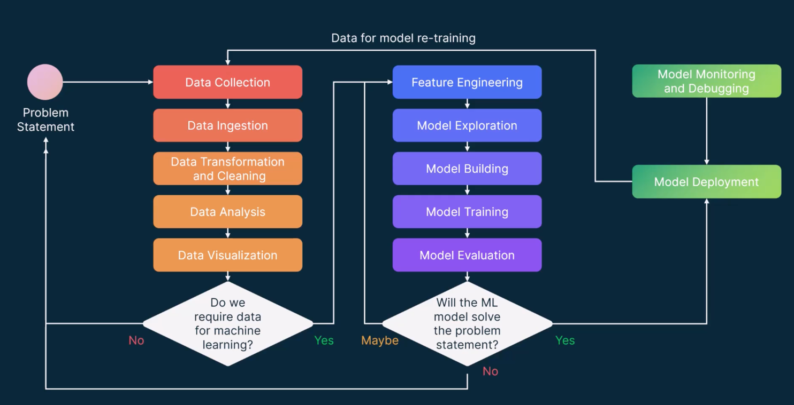

========================
ML-Ops Tools Overview
========================

Machine_learning_model_roles

.. literalinclude:: ../../../2.ml-ops-overview/1.ml-ops-roles.sh
  :language: bash
  :caption: rols_of_machine_learning_models

* **machine-learning-roles-in-model-creation** -

