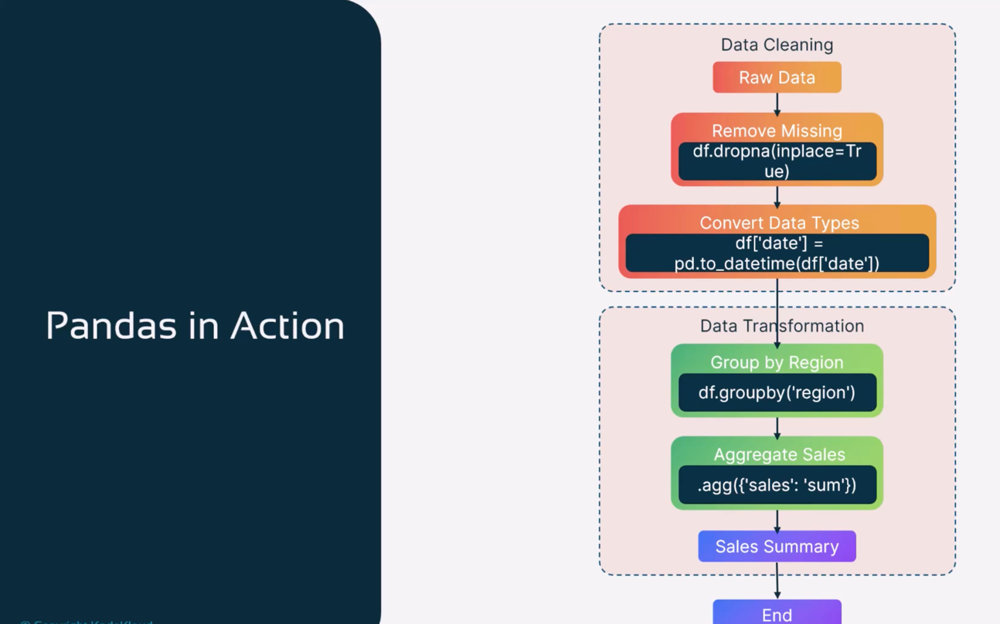
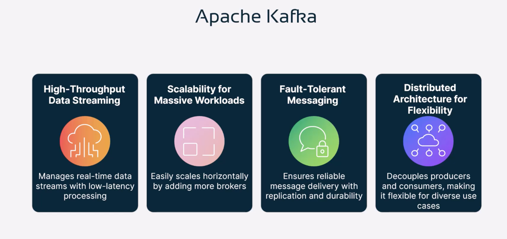
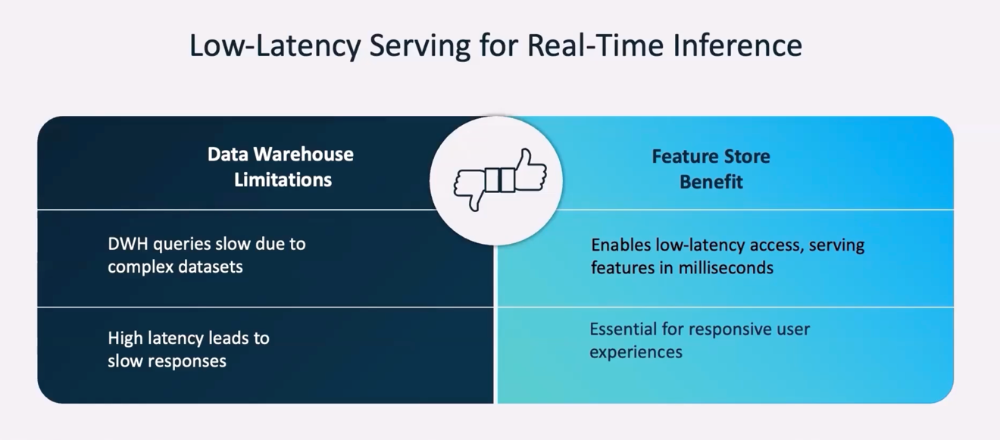

=================================
Data Collection and Preparation
=================================

Install Python Virtual Environments

.. literalinclude:: ../../../3.Data-Collection-and-Preparation/install_venv.sh
  :language: bash
  :caption: Python Virtual Environment Setup

.. literalinclude:: ../../../3.Data-Collection-and-Preparation/install_env2.sh
  :language: bash
  :caption: Alternate Environment Setup

Data_collection_and_Preparation

.. literalinclude:: ../../../3.Data-Collection-and-Preparation/1.demo.sh
  :language: bash
  :caption: data_collection

data_ETL

.. literalinclude:: ../../../3.Data-Collection-and-Preparation/2.Data-ingestion-ETL.sh
  :language: bash
  :caption: data_ETL

Data Lake

.. literalinclude:: ../../../3.Data-Collection-and-Preparation/3.data-lake.sh
  :language: bash
  :caption: Data Lake Setup

Data Cleaning & Transformation

.. literalinclude:: ../../../3.Data-Collection-and-Preparation/4.data-cleaning-and-transformation.sh
  :language: bash
  :caption: Data Cleaning and Transformation

Pandas Demo 1

.. literalinclude:: ../../../3.Data-Collection-and-Preparation/demo-pandas-1/sample-pandas.py
  :language: python
  :caption: Sample Pandas Script
  :linenos:

.. literalinclude:: ../../../3.Data-Collection-and-Preparation/demo-pandas-1/data.csv
  :language: text
  :caption: Sample Input Data (CSV)
  :linenos:

* **pandas-in-action** -

Data Preparation

.. literalinclude:: ../../../3.Data-Collection-and-Preparation/5.data-preparation.sh
  :language: bash
  :caption: Final Preparation

Run Pandas Script

.. literalinclude:: ../../../3.Data-Collection-and-Preparation/6.run-pandas.sh
  :language: bash
  :caption: Run Pandas

Pandas Demo 2

.. literalinclude:: ../../../3.Data-Collection-and-Preparation/demo-pandas-2/test.py
  :language: python
  :caption: Pandas Transformation Script
  :linenos:

.. literalinclude:: ../../../3.Data-Collection-and-Preparation/demo-pandas-2/mock_data.csv
  :language: text
  :caption: Raw Input Data
  :linenos:

.. literalinclude:: ../../../3.Data-Collection-and-Preparation/demo-pandas-2/cleaned_data.csv
  :language: text
  :caption: Cleaned Data Output
  :linenos:

.. literalinclude:: ../../../3.Data-Collection-and-Preparation/demo-pandas-2/transformed_data.csv
  :language: text
  :caption: Transformed Data Output
  :linenos:

Pandas Demo 3

.. literalinclude:: ../../../3.Data-Collection-and-Preparation/demo-pandas-3/mockdata.py
  :language: python
  :caption: Synthetic Mock Data Generator
  :linenos:

.. literalinclude:: ../../../3.Data-Collection-and-Preparation/demo-pandas-3/data-exploration.py
  :language: python
  :caption: Data Exploration
  :linenos:

.. literalinclude:: ../../../3.Data-Collection-and-Preparation/demo-pandas-3/data-cleaning.py
  :language: python
  :caption: Data Cleaning
  :linenos:

.. literalinclude:: ../../../3.Data-Collection-and-Preparation/demo-pandas-3/data-transformation.py
  :language: python
  :caption: Data Transformation
  :linenos:

.. literalinclude:: ../../../3.Data-Collection-and-Preparation/demo-pandas-3/mock_data.csv
  :language: text
  :caption: Input Mock Dataset
  :linenos:

.. literalinclude:: ../../../3.Data-Collection-and-Preparation/demo-pandas-3/cleaned_data.csv
  :language: text
  :caption: Cleaned Output Data
  :linenos:

.. literalinclude:: ../../../3.Data-Collection-and-Preparation/demo-pandas-3/transformed_data.csv
  :language: text
  :caption: Transformed Output Data
  :linenos:

Large Datasets with Apache Spark & Dask

.. literalinclude:: ../../../3.Data-Collection-and-Preparation/7.large-datasets-with-apacheSpark-and-Dask.sh
  :language: bash
  :caption: Spark and Dask

* **Real-time-machine-data-analysis** -

Realtime Streaming Datasets

.. literalinclude:: ../../../3.Data-Collection-and-Preparation/8.Realtime-streaming-datasets.sh
  :language: bash
  :caption: Streaming Data

* **Apache-kafka** -

* **apache-flink** -

* **apache-flink-2** -

.. image:: ../../../3.Data-Collection-and-Preparation/apache_flink2.png
    :width: 100%
    :align: center

Kafka Demo 1

.. literalinclude:: ../../../3.Data-Collection-and-Preparation/demo-apache-kafka-1/docker-compose.yaml
  :language: yaml
  :caption: Kafka Docker Compose
  :linenos:

.. literalinclude:: ../../../3.Data-Collection-and-Preparation/demo-apache-kafka-1/demo.sh
  :language: bash
  :caption: Kafka Setup Script
  :linenos:

.. literalinclude:: ../../../3.Data-Collection-and-Preparation/demo-apache-kafka-1/demo2.sh
  :language: bash
  :caption: Kafka Script 2
  :linenos:

.. literalinclude:: ../../../3.Data-Collection-and-Preparation/demo-apache-kafka-1/python-producers-kafka.py
  :language: python
  :caption: Kafka Python Producer
  :linenos:

.. literalinclude:: ../../../3.Data-Collection-and-Preparation/demo-apache-kafka-1/python-consumers-kafka.py
  :language: python
  :caption: Kafka Python Consumer
  :linenos:

.. literalinclude:: ../../../3.Data-Collection-and-Preparation/demo-apache-kafka-1/test-lambda.py
  :language: python
  :caption: Lambda Function Test Script
  :linenos:

Kafka Demo 2

.. literalinclude:: ../../../3.Data-Collection-and-Preparation/demo-apache-kafka-2/docker-compose.yml
  :language: yaml
  :caption: Docker Compose for Kafka Producer/Consumer
  :linenos:

.. literalinclude:: ../../../3.Data-Collection-and-Preparation/demo-apache-kafka-2/1.demo.sh
  :language: bash
  :caption: Shell Script to Run Kafka
  :linenos:

.. literalinclude:: ../../../3.Data-Collection-and-Preparation/demo-apache-kafka-2/python-kafka-producer.py
  :language: python
  :caption: Python Kafka Producer
  :linenos:

.. literalinclude:: ../../../3.Data-Collection-and-Preparation/demo-apache-kafka-2/python-kafka-consumer.py
  :language: python
  :caption: Python Kafka Consumer
  :linenos:

Kafka Demo 3 - API and Kafka Integration

**01-api-setup**

.. literalinclude:: ../../../3.Data-Collection-and-Preparation/demo-apache-kafka-3/01-api-setup/main.py
  :language: python
  :caption: Flask API Main
  :linenos:

.. literalinclude:: ../../../3.Data-Collection-and-Preparation/demo-apache-kafka-3/01-api-setup/readme.md
  :language: markdown
  :caption: API Setup Documentation
  :linenos:

**02-kafka-producer-consumer**

.. literalinclude:: ../../../3.Data-Collection-and-Preparation/demo-apache-kafka-3/02-kafka-producer-consumer/main.py
  :language: python
  :caption: Kafka Producer-Consumer Script
  :linenos:

.. literalinclude:: ../../../3.Data-Collection-and-Preparation/demo-apache-kafka-3/02-kafka-producer-consumer/demo.sh
  :language: bash
  :caption: Demo Runner for Producer/Consumer
  :linenos:

.. literalinclude:: ../../../3.Data-Collection-and-Preparation/demo-apache-kafka-3/02-kafka-producer-consumer/readme.md
  :language: markdown
  :caption: Producer/Consumer Documentation
  :linenos:

**03-api-to-kafka**

.. literalinclude:: ../../../3.Data-Collection-and-Preparation/demo-apache-kafka-3/03-api-to-kafka/main.py
  :language: python
  :caption: API to Kafka Bridge
  :linenos:

.. literalinclude:: ../../../3.Data-Collection-and-Preparation/demo-apache-kafka-3/03-api-to-kafka/readme.md
  :language: markdown
  :caption: API to Kafka Documentation
  :linenos:

* **traditional-data-lake** -

* **data-lakes-ML-inference** -

* **feature-store-1** -

* **feature-store-2** -

Feature Store Demo

.. literalinclude:: ../../../3.Data-Collection-and-Preparation/9.Feature-store.sh
  :language: bash
  :caption: Feature Store

* **feature-store-3** -

==========================================
Data Pipeline Orchestration with Airflow
==========================================

Airflow Data Pipeline

Environment Setup

.. literalinclude:: ../../../3.Data-Collection-and-Preparation/Data-Pipeline-Orchestration-Airflow/docker-compose.yaml
  :language: yaml
  :caption: Docker Compose for Airflow
  :linenos:

Airflow Execution Scripts1

.. literalinclude:: ../../../3.Data-Collection-and-Preparation/Data-Pipeline-Orchestration-Airflow/1.demo.sh
  :language: bash
  :caption: Airflow Setup Script 1
  :linenos:

.. literalinclude:: ../../../3.Data-Collection-and-Preparation/Data-Pipeline-Orchestration-Airflow/2.demo.sh
  :language: bash
  :caption: Airflow Setup Script 2
  :linenos:

Airflow Pipeline

Airflow DAG Definition

.. literalinclude:: ../../../3.Data-Collection-and-Preparation/Data-Pipeline-Orchestration-Airflow/dags/iot_dag.py
  :language: python
  :caption: IoT DAG
  :linenos:

Airflow Pipeline DAG

Airflow Execution Scripts2

.. literalinclude:: ../../../3.Data-Collection-and-Preparation/Data-Pipeline-Orchestration-Airflow/3.demo.sh
  :language: bash
  :caption: Airflow Setup Script 3
  :linenos:

.. literalinclude:: ../../../3.Data-Collection-and-Preparation/Data-Pipeline-Orchestration-Airflow/demo_logs.sh
  :language: bash
  :caption: Script for Reading Logs
  :linenos:

Supporting Folders
==================

- `plugins/ <https://github.com/Bharathkumarraju/learn-ai-llm-ml-ops/tree/main/3.Data-Collection-and-Preparation/Data-Pipeline-Orchestration-Airflow/plugins/>`__ – Airflow plugin folder

- `config/ <https://github.com/Bharathkumarraju/learn-ai-llm-ml-ops/tree/main/3.Data-Collection-and-Preparation/Data-Pipeline-Orchestration-Airflow/config/>`__ – Airflow config folder

- `logs/ <https://github.com/Bharathkumarraju/learn-ai-llm-ml-ops/tree/main/3.Data-Collection-and-Preparation/Data-Pipeline-Orchestration-Airflow/logs/>`__ – DAG run logs path
