==========================================
Model Development and Training
==========================================

* **Model Development and Training** -

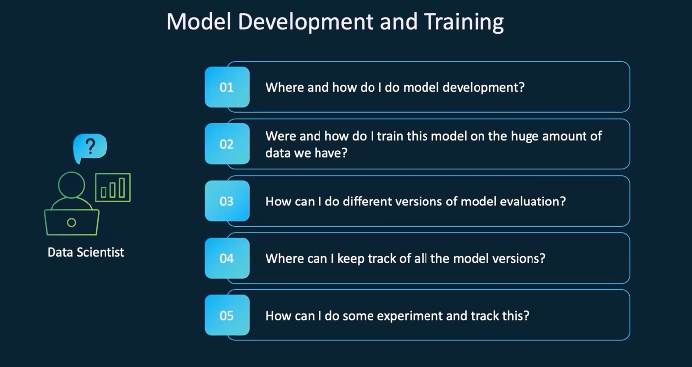

* **Model Development Tools** -

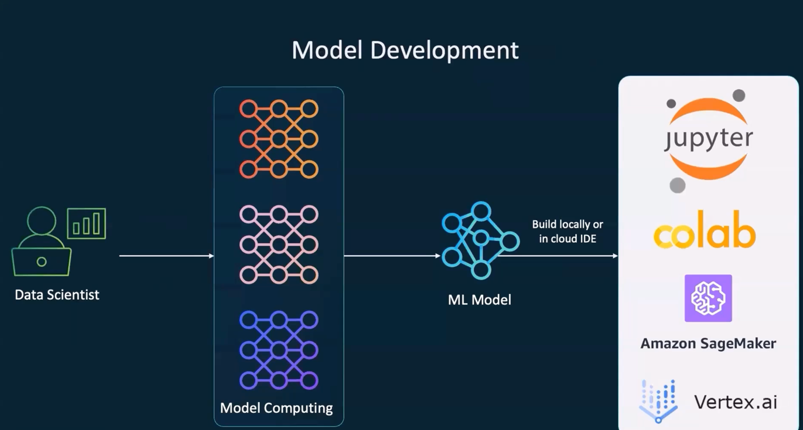

.. literalinclude:: ../../../4.Model-Development-and-Training/2.Model_Training_Hyperparameter_Tuning.sh
  :language: bash
  :caption: Model Training & Hyperparameter Tuning
  :linenos:

.. literalinclude:: ../../../4.Model-Development-and-Training/3.cpus_Vs_gpus.sh
  :language: bash
  :caption: CPUs vs GPUs Comparison
  :linenos:

* **CPU vs GPU** -

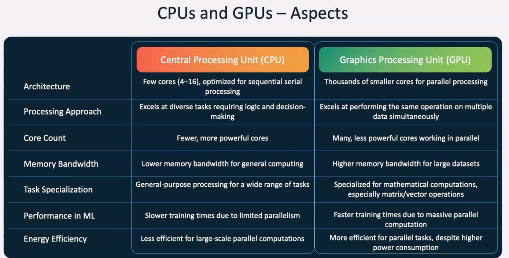

* **MLflow Development Lifecycle** -

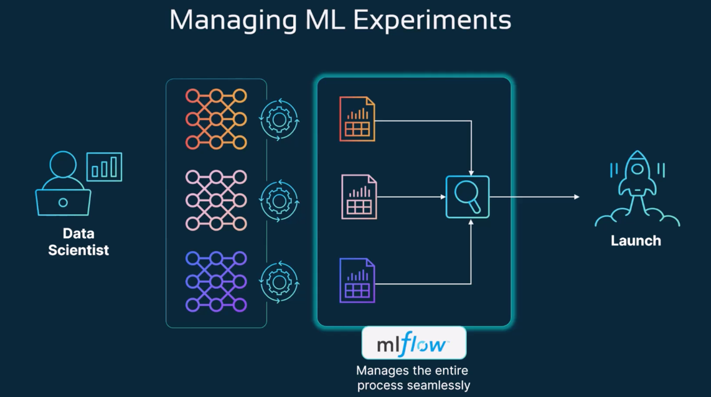

.. literalinclude:: ../../../4.Model-Development-and-Training/4.MLFlow_intro.sh
  :language: bash
  :caption: MLFlow Intro
  :linenos:

.. literalinclude:: ../../../4.Model-Development-and-Training/1.demo-settingup-mlflow/pip-install-mlflow.sh
  :language: bash
  :caption: Install MLflow
  :linenos:

* **MLflow UI** -

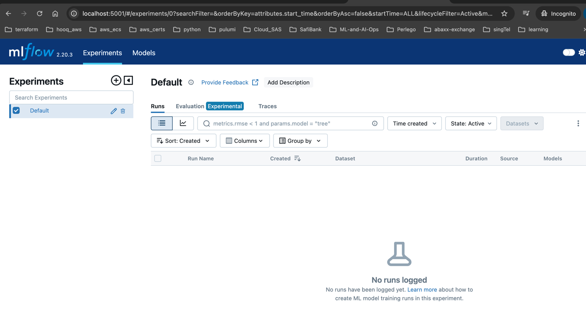

* **MLflow UI Supports Multiple Models** -

.. literalinclude:: ../../../4.Model-Development-and-Training/1.demo-settingup-mlflow/mlflow_log_traces_for_langchain.py
  :language: python
  :caption: MLflow Log - Langchain
  :linenos:

.. literalinclude:: ../../../4.Model-Development-and-Training/1.demo-settingup-mlflow/mlflow_log_traces_for_llamaindex.py
  :language: python
  :caption: MLflow Log - LlamaIndex
  :linenos:

.. literalinclude:: ../../../4.Model-Development-and-Training/1.demo-settingup-mlflow/mlflow_log_traces_for_autogen.py
  :language: python
  :caption: MLflow Log - AutoGen
  :linenos:

.. literalinclude:: ../../../4.Model-Development-and-Training/1.demo-settingup-mlflow/mlflow_log_traces_for_openAPI.py
  :language: python
  :caption: MLflow Log - OpenAPI
  :linenos:

.. literalinclude:: ../../../4.Model-Development-and-Training/1.demo-settingup-mlflow/mlflow_log_traces_for_custom_app.py
  :language: python
  :caption: MLflow Log - Custom App
  :linenos:

* **Model Development and Training** -

.. literalinclude:: ../../../4.Model-Development-and-Training/1.demo.sh
  :language: bash
  :caption: MLflow Setup Demo
  :linenos:

* **MLflow Example Demo** -

.. literalinclude:: ../../../4.Model-Development-and-Training/2.demo-experimenting-storing-result-in-mlflow/requirements.txt
  :language: text
  :caption: Requirements
  :linenos:

.. literalinclude:: ../../../4.Model-Development-and-Training/2.demo-experimenting-storing-result-in-mlflow/validation.py
  :language: python
  :caption: Validation Script
  :linenos:

.. literalinclude:: ../../../4.Model-Development-and-Training/2.demo-experimenting-storing-result-in-mlflow/example-mlflow.py
  :language: python
  :caption: Example MLflow Python Script
  :linenos:

* **ML Model Experiment** -

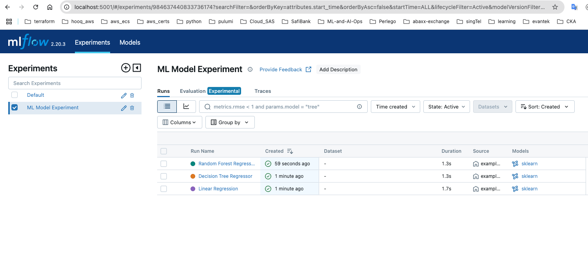

* **Run ML Model Experiment** -

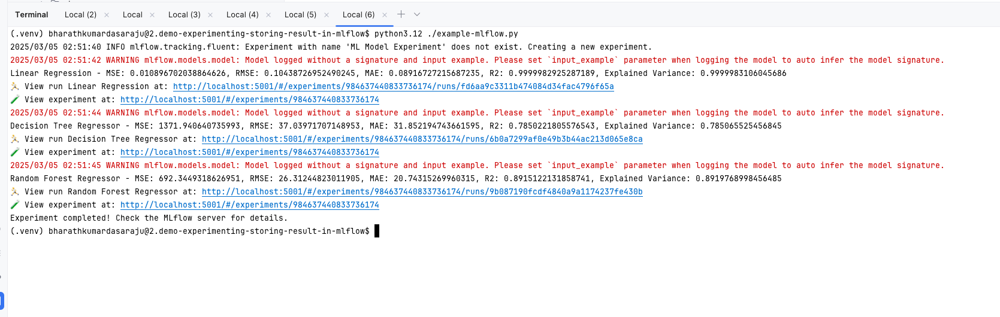

.. literalinclude:: ../../../4.Model-Development-and-Training/2.demo-experimenting-storing-result-in-mlflow/1.experiments-in-mlflow.sh
  :language: bash
  :caption: Experiments in MLflow
  :linenos:

* **Evaluate ML Models** -

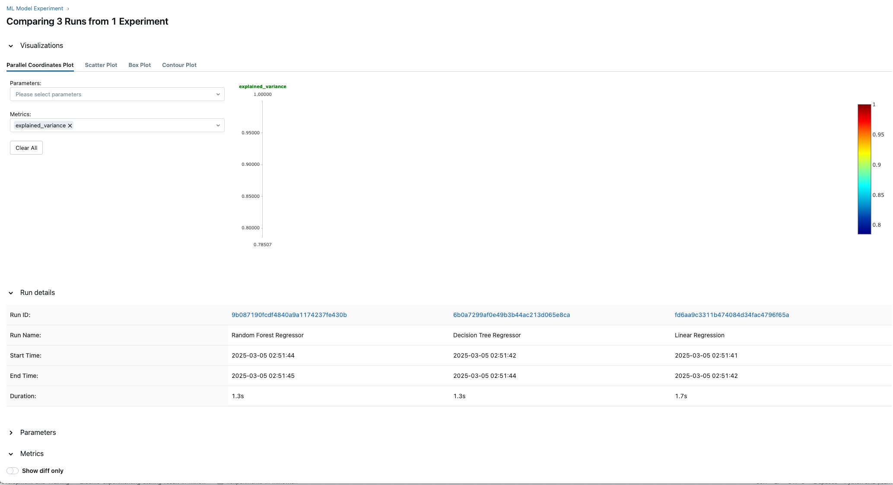

* **Compare ML Model Runs** -

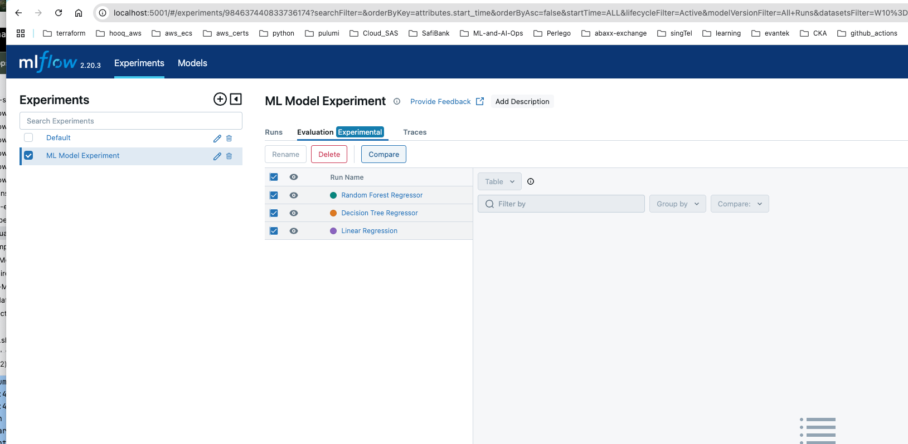

* **Model Artifacts** -

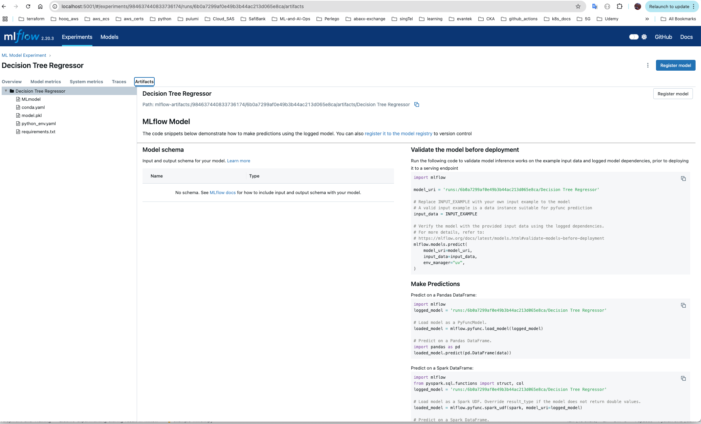

.. literalinclude:: ../../../4.Model-Development-and-Training/2.demo-experimenting-storing-result-in-mlflow/2.Store-model-file-in-model-registry.sh
  :language: bash
  :caption: Store Model in Registry
  :linenos:

* **New ML Deployment** -

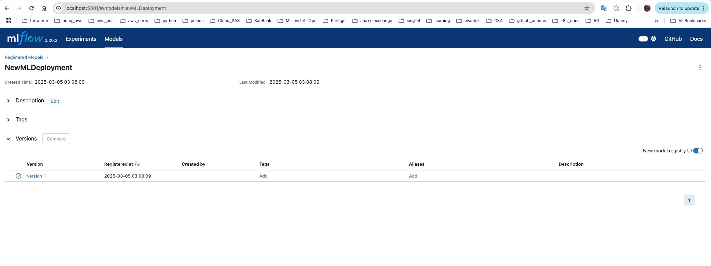

.. literalinclude:: ../../../4.Model-Development-and-Training/2.demo-experimenting-storing-result-in-mlflow/model.pkl
  :language: text
  :caption: Model Pickle File
  :linenos:

.. literalinclude:: ../../../4.Model-Development-and-Training/2.demo-experimenting-storing-result-in-mlflow/open-model-pkl-file-locally.py
  :language: python
  :caption: Open Model File
  :linenos:

.. literalinclude:: ../../../4.Model-Development-and-Training/2.demo-experimenting-storing-result-in-mlflow/open-model-pkl-file-locally-v1.py
  :language: python
  :caption: Open Model File v1
  :linenos:

.. literalinclude:: ../../../4.Model-Development-and-Training/2.demo-experimenting-storing-result-in-mlflow/3.data-mlflow.sh
  :language: bash
  :caption: Data Handling in MLflow
  :linenos:

MLflow Runs Directory
=====================

- `mlruns/ <https://github.com/Bharathkumarraju/learn-ai-llm-ml-ops/tree/main/4.Model-Development-and-Training/2.demo-experimenting-storing-result-in-mlflow/mlruns/>`__ – MLflow runs directory in MLflow Example

Supporting Folders
==================

- `mlruns/ <https://github.com/Bharathkumarraju/learn-ai-llm-ml-ops/tree/main/4.Model-Development-and-Training/mlruns/>`__ – MLflow runs directory
- `mlartifacts/ <https://github.com/Bharathkumarraju/learn-ai-llm-ml-ops/tree/main/4.Model-Development-and-Training/mlartifacts/>`__ – MLflow model artifacts directory
