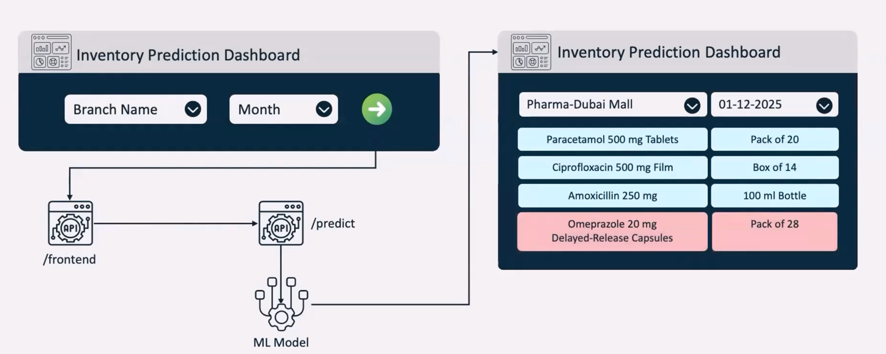
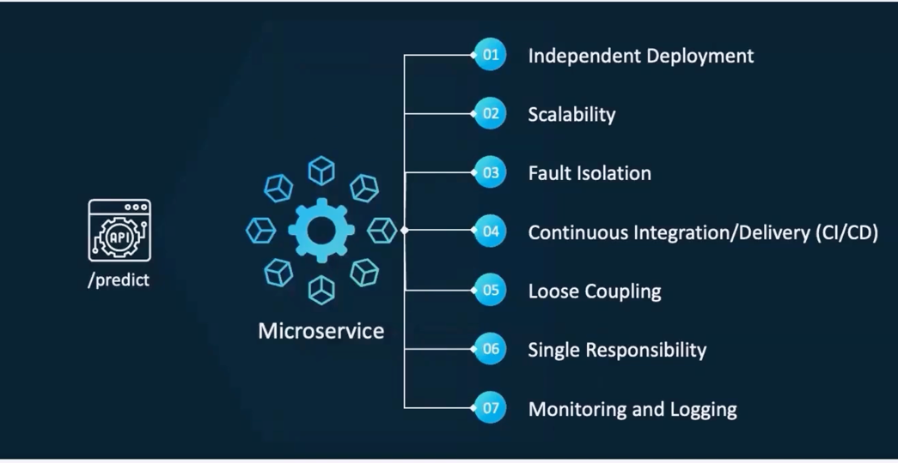
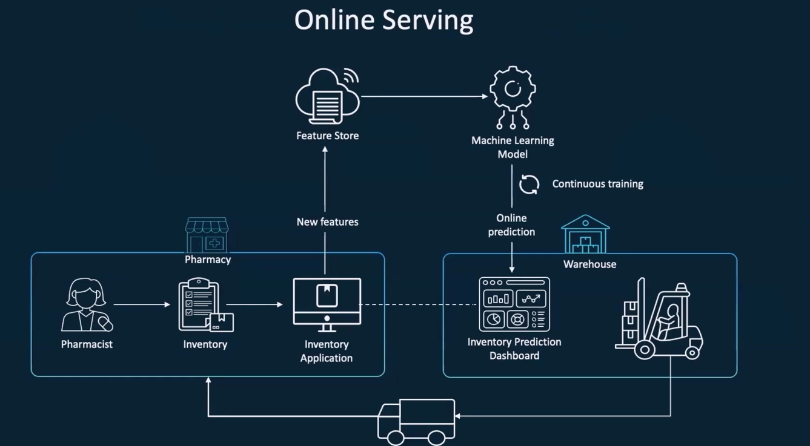
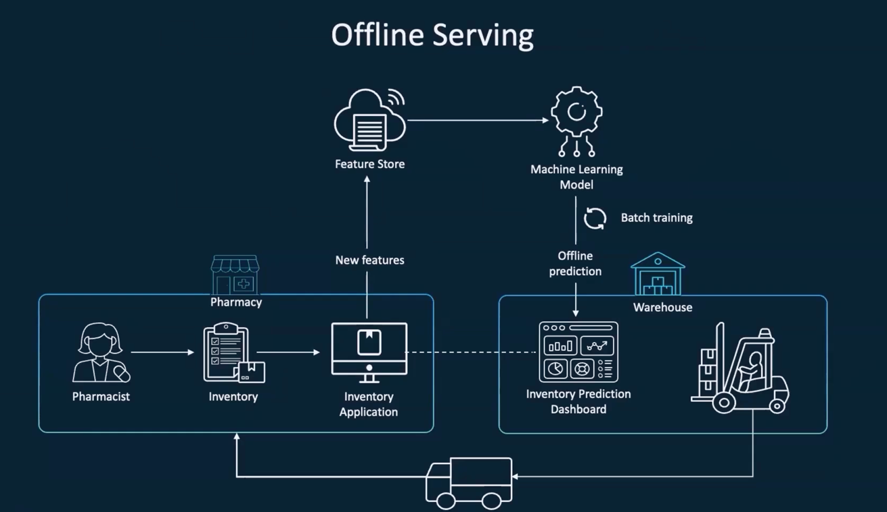
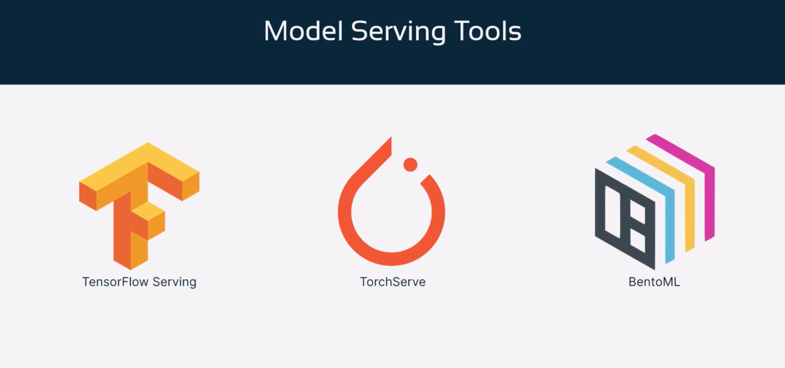
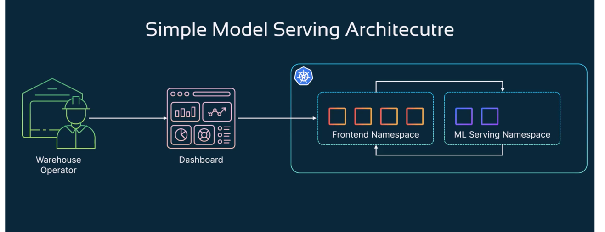
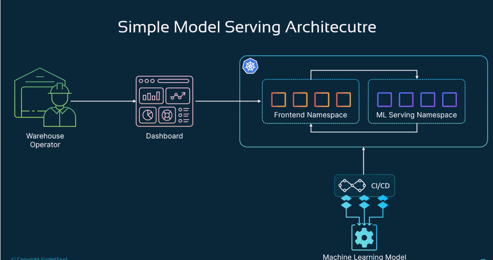
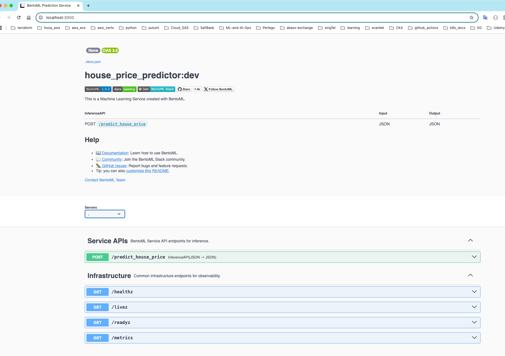
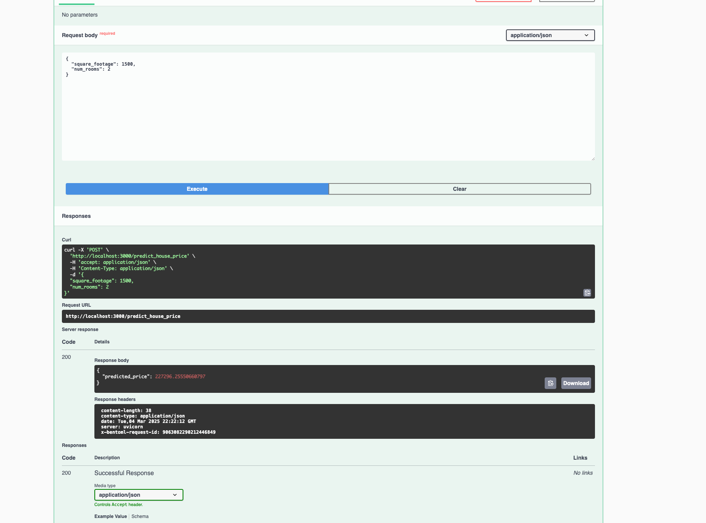
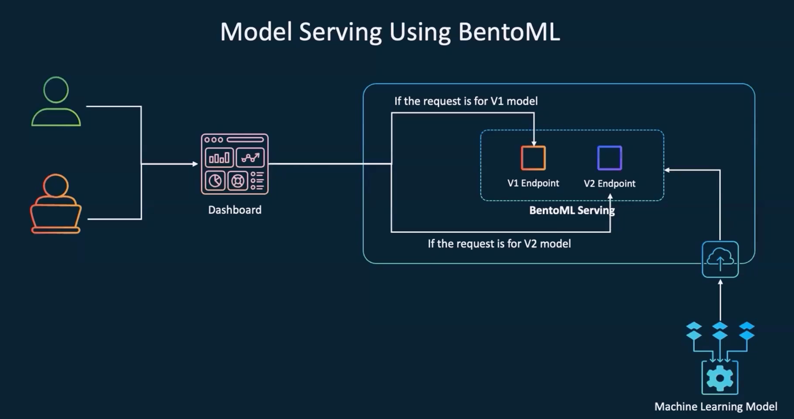

==========================================
Model Deployment and Serving
==========================================

* **Model Integration with App/API** -

.. literalinclude:: ../../../5.Model-Deployment-and-Serving/1.demo.sh
  :language: bash
  :caption: Initial Demo Script
  :linenos:

* **MLModel API Microservice** -

.. literalinclude:: ../../../5.Model-Deployment-and-Serving/2.deploy-mlmodel-api.sh
  :language: bash
  :caption: Deploy ML Model API
  :linenos:

* **Online Prediction** -

.. literalinclude:: ../../../5.Model-Deployment-and-Serving/3.model_drift_offline_online_serving.sh
  :language: bash
  :caption: Model Drift & Offline/Online Serving
  :linenos:

* **Offline Prediction** -

* **Model Serving Tools** -

* **Simple ML Model Serving Architecture** -

.. literalinclude:: ../../../5.Model-Deployment-and-Serving/4.Model-serving-tools.sh
  :language: bash
  :caption: Script - Model Serving Tools
  :linenos:

* **Simple ML Model Serving Architecture v1** -

**Model Service Code (BentoML)**

.. literalinclude:: ../../../5.Model-Deployment-and-Serving/1.demo-model-train-service-BentoML/model_service_v1.py
  :language: python
  :caption: Model Service V1
  :linenos:

.. literalinclude:: ../../../5.Model-Deployment-and-Serving/1.demo-model-train-service-BentoML/model_service_v2.py
  :language: python
  :caption: Model Service V2
  :linenos:

.. literalinclude:: ../../../5.Model-Deployment-and-Serving/1.demo-model-train-service-BentoML/model_service_v3.py
  :language: python
  :caption: Model Service V3
  :linenos:

.. literalinclude:: ../../../5.Model-Deployment-and-Serving/1.demo-model-train-service-BentoML/model_train_v1.py
  :language: python
  :caption: Model Training V1
  :linenos:

.. literalinclude:: ../../../5.Model-Deployment-and-Serving/1.demo-model-train-service-BentoML/model_train_v2.py
  :language: python
  :caption: Model Training V2
  :linenos:

.. literalinclude:: ../../../5.Model-Deployment-and-Serving/1.demo-model-train-service-BentoML/readme.md
  :language: markdown
  :caption: README - BentoML Service
  :linenos:

* **BentoML Prediction Service** -

* **House Price Prediction using BentoML** -

* **Serve Multiple ML Models with BentoML** -

.. literalinclude:: ../../../5.Model-Deployment-and-Serving/1.demo-model-train-service-BentoML/1.deploy-mlmodel-in-BentoML.sh
  :language: bash
  :caption: Deploy Model in BentoML
  :linenos:

**ML Model Testing with BentoML**

.. literalinclude:: ../../../5.Model-Deployment-and-Serving/2.demo-mlmodel-tests-bentoml/1.demo.sh
  :language: bash
  :caption: ML Model Testing Script
  :linenos:

.. literalinclude:: ../../../5.Model-Deployment-and-Serving/5.Monitoring-ml-models.sh
  :language: bash
  :caption: Monitoring ML Models
  :linenos:

