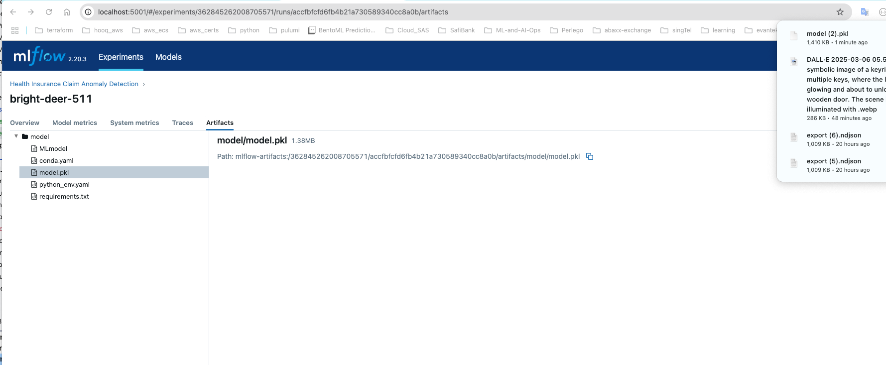
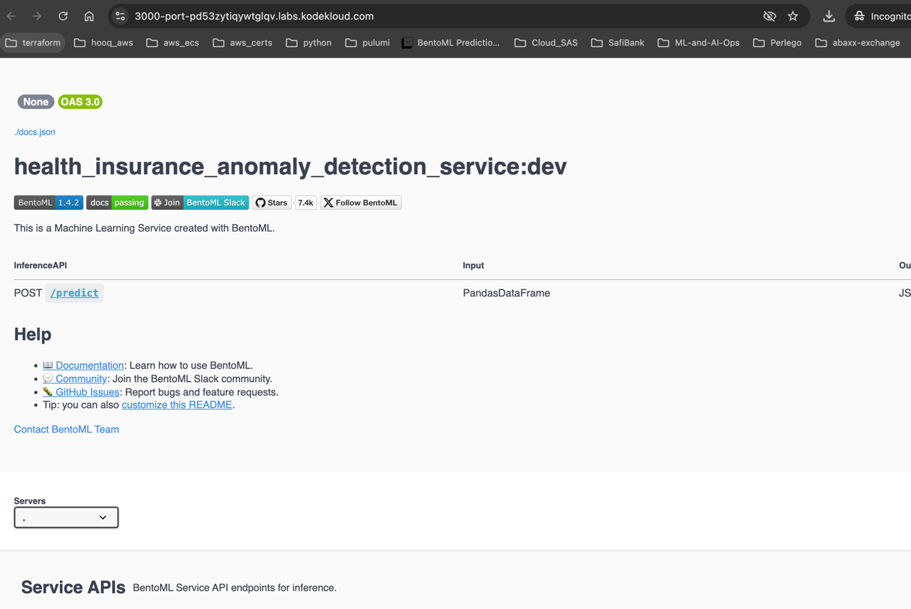

==========================================
Automating with MLflow and BentoML
==========================================

**Flask App for ML Prediction**

.. literalinclude:: ../../../6.Automating-with-MLflow-and-BentoML/flask_app.py
  :language: python
  :caption: Flask App for ML Prediction
  :linenos:

**README**

.. literalinclude:: ../../../6.Automating-with-MLflow-and-BentoML/readme.md
  :language: markdown
  :caption: README
  :linenos:

**Model Registration Script**

.. literalinclude:: ../../../6.Automating-with-MLflow-and-BentoML/register_model.py
  :language: python
  :caption: Model Registration Script
  :linenos:

**Python Requirements**

.. literalinclude:: ../../../6.Automating-with-MLflow-and-BentoML/requirements.txt
  :language: text
  :caption: Python Requirements
  :linenos:

**ML Service**

.. literalinclude:: ../../../6.Automating-with-MLflow-and-BentoML/service.py
  :language: python
  :caption: ML Service
  :linenos:

**Synthetic Claims Generator**

.. literalinclude:: ../../../6.Automating-with-MLflow-and-BentoML/synthetic_health_claims.py
  :language: python
  :caption: Synthetic Claims Generator
  :linenos:

**Claim Test**

.. literalinclude:: ../../../6.Automating-with-MLflow-and-BentoML/test_claim.py
  :language: python
  :caption: Claim Test
  :linenos:

**Flask App v2**

.. literalinclude:: ../../../6.Automating-with-MLflow-and-BentoML/v2_app.py
  :language: python
  :caption: Flask App v2
  :linenos:

**Templates**

.. literalinclude:: ../../../6.Automating-with-MLflow-and-BentoML/templates/index.html
  :language: html
  :caption: index.html
  :linenos:

.. literalinclude:: ../../../6.Automating-with-MLflow-and-BentoML/templates/result.html
  :language: html
  :caption: result.html
  :linenos:

.. literalinclude:: ../../../6.Automating-with-MLflow-and-BentoML/templates/visualize.html
  :language: html
  :caption: visualize.html
  :linenos:

**ML Model for Insurance Claims**

**Initial Setup Script**

.. literalinclude:: ../../../6.Automating-with-MLflow-and-BentoML/1.demo.sh
  :language: bash
  :caption: Initial Setup Script
  :linenos:

**Claims Dataset**

.. literalinclude:: ../../../6.Automating-with-MLflow-and-BentoML/synthetic_health_claims.csv
  :language: text
  :caption: Claims Dataset
  :linenos:

**Isolation Forest Model**

.. literalinclude:: ../../../6.Automating-with-MLflow-and-BentoML/isolation_model.py
  :language: python
  :caption: Isolation Forest Model
  :linenos:

**Create MLflow Experiment**

**Download Model PKL File**

**Trained Model File**

.. literalinclude:: ../../../6.Automating-with-MLflow-and-BentoML/model.pkl
  :language: text
  :caption: Trained Model File
  :linenos:

**Serve MLModel in BentoML**

**Deploy Flask Web App**

**Model Predictions in UI**

**ML Model Final Output**

**Second Demo Script**

.. literalinclude:: ../../../6.Automating-with-MLflow-and-BentoML/2.demo.sh
  :language: bash
  :caption: Second Demo Script
  :linenos:

**Session Data**

.. literalinclude:: ../../../6.Automating-with-MLflow-and-BentoML/session_data.csv
  :language: text
  :caption: Session Data
  :linenos:

**Third Demo Script**

.. literalinclude:: ../../../6.Automating-with-MLflow-and-BentoML/3.demo.sh
  :language: bash
  :caption: Third Demo Script
  :linenos:

==========================================
Supporting Folders
==========================================

- `mlruns/ <https://github.com/Bharathkumarraju/learn-ai-llm-ml-ops/tree/main/6.Automating-with-MLflow-and-BentoML/mlruns/>`__ – MLflow run artifacts
- `mlartifacts/ <https://github.com/Bharathkumarraju/learn-ai-llm-ml-ops/tree/main/6.Automating-with-MLflow-and-BentoML/mlartifacts/>`__ – Model artifacts
- `templates/ <https://github.com/Bharathkumarraju/learn-ai-llm-ml-ops/tree/main/6.Automating-with-MLflow-and-BentoML/templates/>`__ – HTML templates

==========================================
3.demo Outputs
==========================================

**MLflow Experiments**

**Script to Download Model**

.. literalinclude:: ../../../6.Automating-with-MLflow-and-BentoML/3.demo/download_model_pkl.py
  :language: python
  :caption: Script to Download Model
  :linenos:

**BentoML Serving**

**Flask App UI**

**File Server UI**

**Predicted ML Results**

==========================================
3.demo → labs → assets → 05-project
==========================================

**Flask App v2**

.. literalinclude:: ../../../6.Automating-with-MLflow-and-BentoML/3.demo/labs/assets/05-project/v2_app.py
  :language: python
  :caption: Flask App Version 2
  :linenos:

**Test Claim**

.. literalinclude:: ../../../6.Automating-with-MLflow-and-BentoML/3.demo/labs/assets/05-project/test_claim.py
  :language: python
  :caption: Test Script for Health Claim
  :linenos:

**Synthetic Health Claims Generator**

.. literalinclude:: ../../../6.Automating-with-MLflow-and-BentoML/3.demo/labs/assets/05-project/synthetic_health_claims.py
  :language: python
  :caption: Generate Synthetic Claims
  :linenos:

**ML Service**

.. literalinclude:: ../../../6.Automating-with-MLflow-and-BentoML/3.demo/labs/assets/05-project/service.py
  :language: python
  :caption: Service Layer
  :linenos:

**Python Requirements**

.. literalinclude:: ../../../6.Automating-with-MLflow-and-BentoML/3.demo/labs/assets/05-project/requirements.txt
  :language: text
  :caption: Requirements File
  :linenos:

**Register Model Script**

.. literalinclude:: ../../../6.Automating-with-MLflow-and-BentoML/3.demo/labs/assets/05-project/register_model.py
  :language: python
  :caption: Model Registration
  :linenos:

**README**

.. literalinclude:: ../../../6.Automating-with-MLflow-and-BentoML/3.demo/labs/assets/05-project/readme.md
  :language: markdown
  :caption: Project Documentation
  :linenos:

**Isolation Model**

.. literalinclude:: ../../../6.Automating-with-MLflow-and-BentoML/3.demo/labs/assets/05-project/isolation_model.py
  :language: python
  :caption: Isolation Forest Implementation
  :linenos:

**Synthetic Claims Dataset**

.. literalinclude:: ../../../6.Automating-with-MLflow-and-BentoML/3.demo/labs/assets/05-project/synthetic_health_claims.csv
  :language: text
  :caption: Dataset - Synthetic Claims
  :linenos:

**Download Model Script**

.. literalinclude:: ../../../6.Automating-with-MLflow-and-BentoML/3.demo/labs/assets/05-project/download_model_pkl.py
  :language: python
  :caption: Script to Load Trained Model
  :linenos:

**Trained Model File**

.. literalinclude:: ../../../6.Automating-with-MLflow-and-BentoML/3.demo/labs/assets/05-project/model.pkl
  :language: text
  :caption: Trained ML Model (Pickle Format)
  :linenos:

**Flask App Script**

.. literalinclude:: ../../../6.Automating-with-MLflow-and-BentoML/3.demo/labs/assets/05-project/flask_app.py
  :language: python
  :caption: Web App to Serve Model
  :linenos:

**Templates**

.. literalinclude:: ../../../6.Automating-with-MLflow-and-BentoML/3.demo/labs/assets/05-project/templates/visualize.html
  :language: html
  :caption: Visualize Template
  :linenos:

.. literalinclude:: ../../../6.Automating-with-MLflow-and-BentoML/3.demo/labs/assets/05-project/templates/result.html
  :language: html
  :caption: Result Template
  :linenos:

.. literalinclude:: ../../../6.Automating-with-MLflow-and-BentoML/3.demo/labs/assets/05-project/templates/index.html
  :language: html
  :caption: Index Template
  :linenos:

==========================================
Supporting Folders
==========================================

==========================================
Supporting Folders
==========================================

- `3.demo/ <https://github.com/Bharathkumarraju/learn-ai-llm-ml-ops/tree/main/6.Automating-with-MLflow-and-BentoML/3.demo/>`__ – Final project outputs and UI
- `3.demo/labs/ <https://github.com/Bharathkumarraju/learn-ai-llm-ml-ops/tree/main/6.Automating-with-MLflow-and-BentoML/3.demo/labs/>`__ – Project lab environment
- `3.demo/labs/assets/05-project/ <https://github.com/Bharathkumarraju/learn-ai-llm-ml-ops/tree/main/6.Automating-with-MLflow-and-BentoML/3.demo/labs/assets/05-project/>`__ – Full working ML app project source
- `3.demo/labs/mlruns/ <https://github.com/Bharathkumarraju/learn-ai-llm-ml-ops/tree/main/6.Automating-with-MLflow-and-BentoML/3.demo/labs/mlruns/>`__ – MLflow run artifacts
- `3.demo/labs/mlartifacts/ <https://github.com/Bharathkumarraju/learn-ai-llm-ml-ops/tree/main/6.Automating-with-MLflow-and-BentoML/3.demo/labs/mlartifacts/>`__ – Model pickle/artifact storage
- `3.demo/labs/bentoml/ <https://github.com/Bharathkumarraju/learn-ai-llm-ml-ops/tree/main/6.Automating-with-MLflow-and-BentoML/3.demo/labs/bentoml/>`__ – BentoML service-related files and configs
