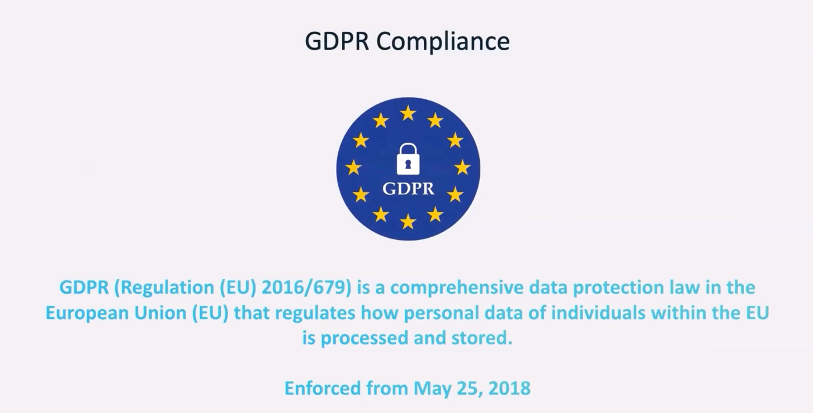
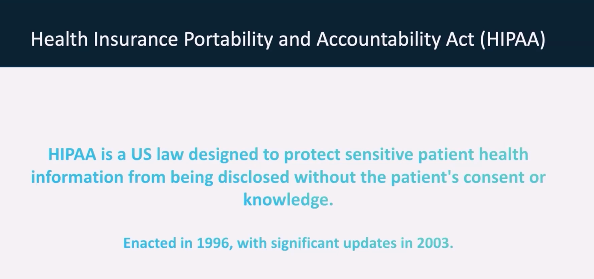
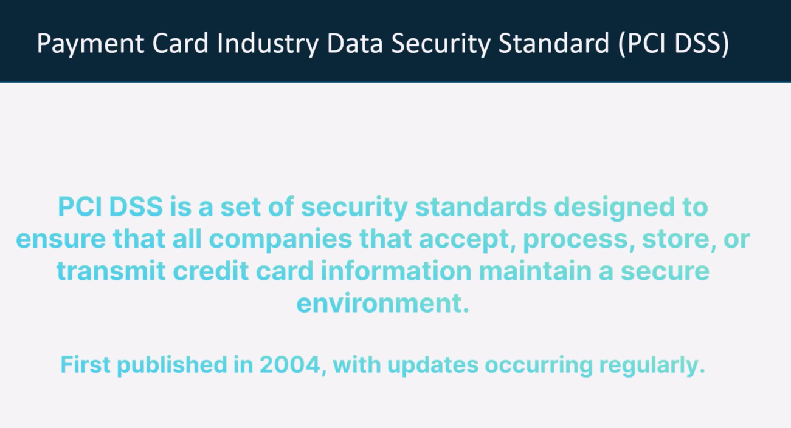
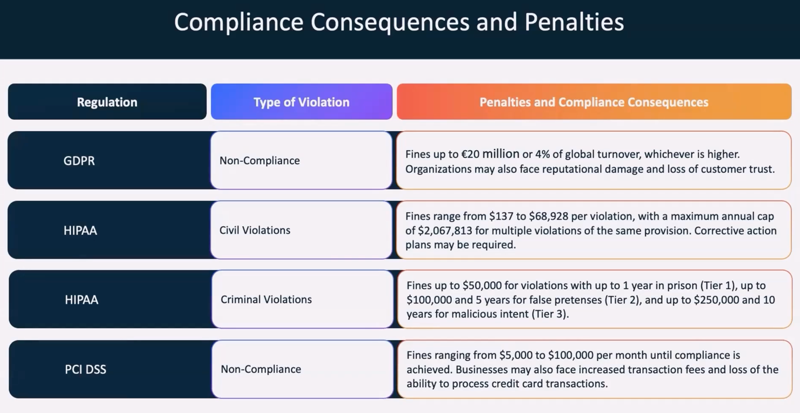

==========================================
Data Security and Governance
==========================================

**Demo Script**

.. literalinclude:: ../../../7.Data-Security-and-Governance/1.demo.sh
  :language: bash
  :caption: Demo Bootstrap Script
  :linenos:

**Data Privacy and Security**

.. literalinclude:: ../../../7.Data-Security-and-Governance/1.Data_Privacy_and_data_security.sh
  :language: bash
  :caption: Data Privacy and Security Measures
  :linenos:

**Data Access Management**

.. literalinclude:: ../../../7.Data-Security-and-Governance/2.Data-Access-management.sh
  :language: bash
  :caption: Data Access Management
  :linenos:

**Data Retention Policy**

.. literalinclude:: ../../../7.Data-Security-and-Governance/3.Data-Retention.sh
  :language: bash
  :caption: Data Retention Strategy
  :linenos:

**GDPR (General Data Protection Regulation)**

.. literalinclude:: ../../../7.Data-Security-and-Governance/4.Compliance-gdpr.sh
  :language: bash
  :caption: GDPR Compliance Script
  :linenos:

**HIPAA (Health Insurance Portability and Accountability Act)**

.. literalinclude:: ../../../7.Data-Security-and-Governance/5.HIPAA-Compliance.sh
  :language: bash
  :caption: HIPAA Compliance Script
  :linenos:

**PCI DSS (Payment Card Industry Data Security Standard)**

.. literalinclude:: ../../../7.Data-Security-and-Governance/6.PCI-DSS-Compliance.sh
  :language: bash
  :caption: PCI-DSS Compliance Script
  :linenos:

**Compliance Consequences**

